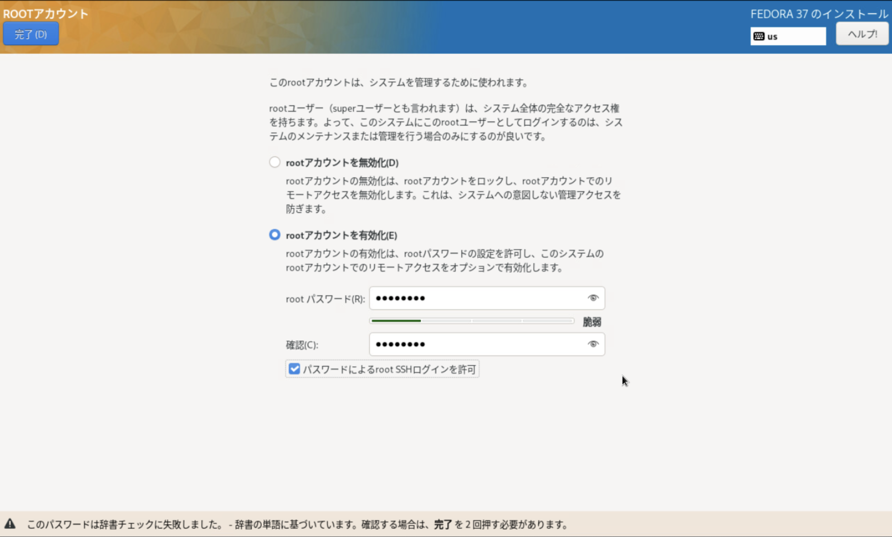
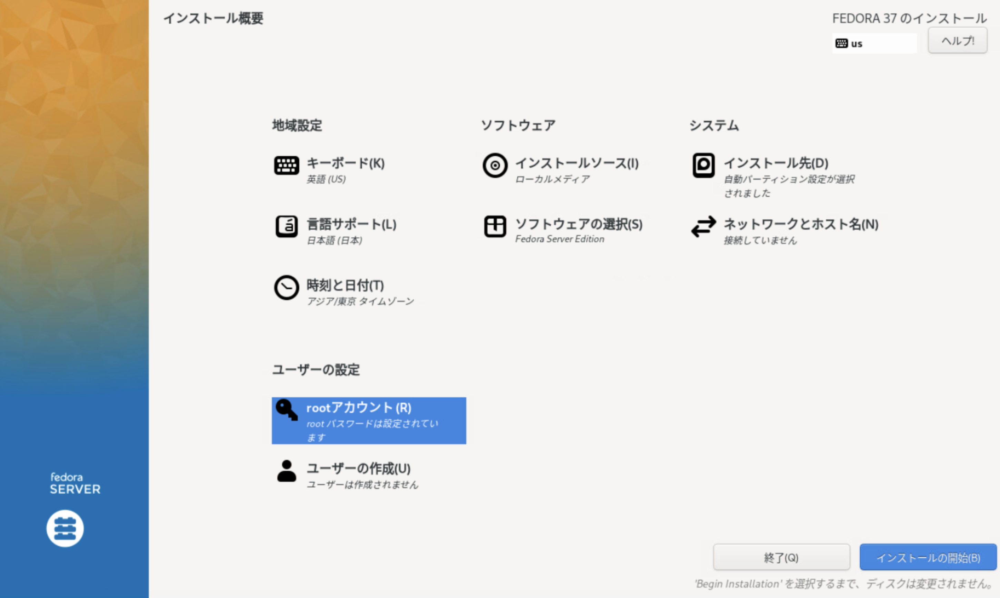
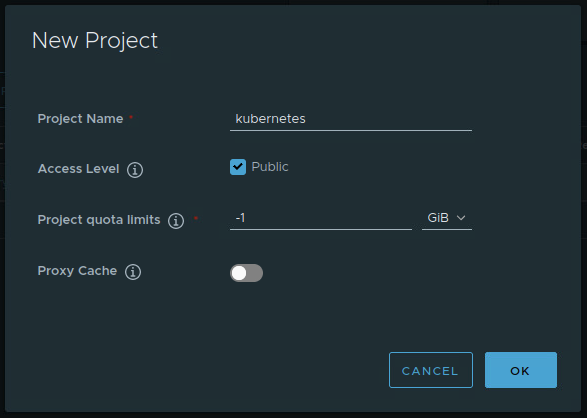
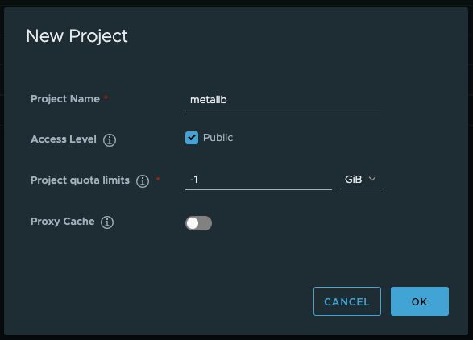
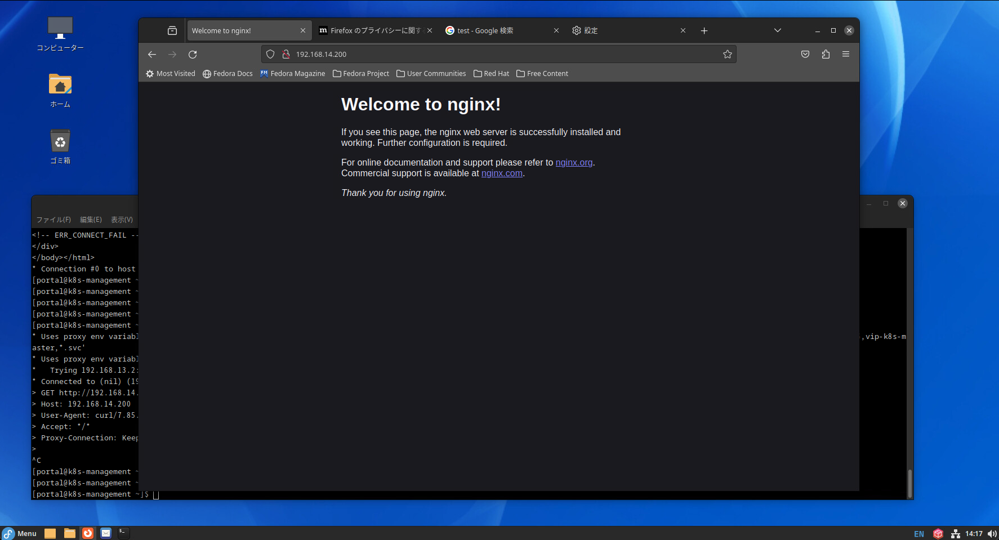
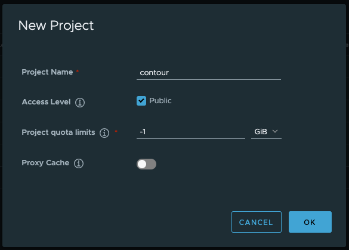
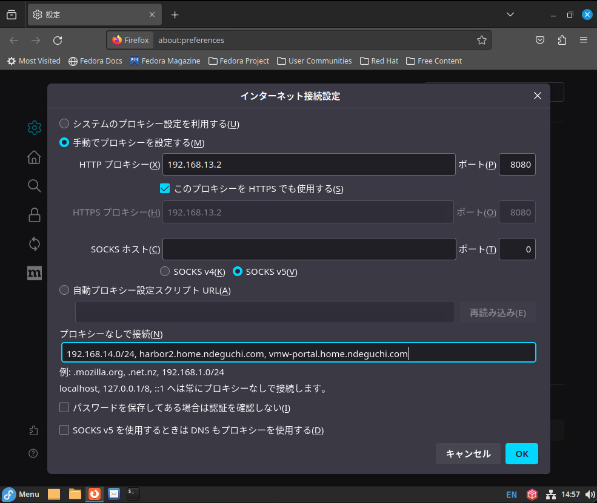
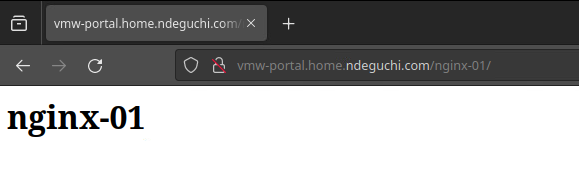
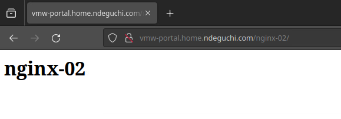

# Fedora37 + Kubernetes + Proxy

## Fedora 構築

- 以下の構成で Fedora を 5 台構築する。（ControlPlane: 3台, WorkerNode: 2台）
  - 仮想マシンスペック
    - CPU: 2 core
    - Mem: 4 GB
    - Disk: 80 GB
  - インストールメディア
    - Fedora-Server-dvd-x86_64-37-1.7.iso

- インストール時に以下を設定する
  - root アカウントを有効化
  - パスワードによるroot SSHログインを許可
  - 
  - 


## 共通設定作業

- [共通設定作業](50-common.md) を実施する。


## Harbor の証明書取得・動作確認

実施対象サーバ：5台全て

- Harbor の CA 証明書を取得

  ```bash
  mkdir -p /etc/docker/certs.d/${harbor_fqdn}
  cd /etc/docker/certs.d/${harbor_fqdn}
  scp root@${harbor_fqdn}:/root/ca.crt .
  ll
    # -> ca.crt が存在すること
  ```

- docker login
  
  ```
  docker login ${harbor_fqdn} --username admin
  ```
  - 確認観点：パスワード入力後、 `Login Succeeded` が出力されること

    ```text
    <出力例>
    Password:
    WARNING! Your password will be stored unencrypted in /root/.docker/config.json.
    Configure a credential helper to remove this warning. See
    https://docs.docker.com/engine/reference/commandline/login/#credentials-store
    
    Login Succeeded
    ```

- Pull 確認

  ```bash
  # Pull
  docker pull ${harbor_fqdn}/library/nginx:latest
  ```

  - 確認観点：Harbor から image を pull できること

    ```text
    <出力例>
    latest: Pulling from library/nginx
    1f7ce2fa46ab: Pull complete
    9b16c94bb686: Pull complete
    9a59d19f9c5b: Pull complete
    9ea27b074f71: Pull complete
    c6edf33e2524: Pull complete
    84b1ff10387b: Pull complete
    517357831967: Pull complete
    Digest: sha256:3c4c1f42a89e343c7b050c5e5d6f670a0e0b82e70e0e7d023f10092a04bbb5a7
    Status: Downloaded newer image for harbor2.home.ndeguchi.com/library/nginx:latest
    harbor2.home.ndeguchi.com/library/nginx:latest
    ```

  ```bash
  # 確認
  docker images | grep "nginx.*latest"
  ```

  - 確認観点：pull したイメージが存在すること

    ```text
    <出力例>
    harbor2.home.ndeguchi.com/library/nginx   latest     a6bd71f48f68   2 weeks ago     187MB
    ```

  ```bash
  # pull したイメージを削除する
  docker rmi ${harbor_fqdn}/library/nginx:latest
  docker images | grep "nginx.*latest"
    # -> イメージが存在しないこと(何も出力されないこと)
  ```

## Swap Off

実施対象サーバ：5台全て

- スワップを無効化する

  ```bash
  dnf remove -y zram-generator-defaults
  swapoff -a
  swapon --show
  # 何も出力されないことを確認する
  ```

## Forwarding/Bridge 許可

実施対象サーバ：5台全て

- IP Forwarding と Bridge を有効化する

  ```bash
  cat <<EOF | tee /etc/modules-load.d/k8s.conf
  overlay
  br_netfilter
  EOF
  
  modprobe overlay 
  
  modprobe br_netfilter
  
  cat <<EOF | tee /etc/sysctl.d/k8s.conf
  net.bridge.bridge-nf-call-iptables = 1
  net.bridge.bridge-nf-call-ip6tables = 1
  net.ipv4.ip_forward = 1
  EOF
  ```
  
- 再起動後、設定が反映されていることを確認する

  ```bash
  # 再起動
  shutdown -r now
  
  # 確認
  sysctl net.bridge.bridge-nf-call-iptables net.bridge.bridge-nf-call-ip6tables net.ipv4.ip_forward
  ```

  - 確認観点：すべて 1 が指定されていること

    ```text
    net.bridge.bridge-nf-call-iptables = 1
    net.bridge.bridge-nf-call-ip6tables = 1
    net.ipv4.ip_forward = 1
    ```

## cri-dockerd インストール

実施対象サーバ：5台全て

- コンテナランタイムは Docker を使用するため cri-dockerd をインストールする

  ```bash
  # 前提パッケージインストール
  dnf install -y git make go
  
  # git コマンドの proxy 設定
  git config --global http.proxy http://${proxy_ip_port}
  
  # cri-dockerd をダウンロード
  cd ; git clone https://github.com/Mirantis/cri-dockerd.git
  
  # cri-dockerd をビルド
  cd cri-dockerd
  make cri-dockerd
  
  # cri-dockerd をインストール
  mkdir -p /usr/local/bin
  install -o root -g root -m 0755 cri-dockerd /usr/local/bin/cri-dockerd
  install packaging/systemd/* /etc/systemd/system
  cp -p /etc/systemd/system/cri-docker.service ~/cri-docker.service.org
  sed -i -e 's,/usr/bin/cri-dockerd,/usr/local/bin/cri-dockerd,' /etc/systemd/system/cri-docker.service
  diff -u ~/cri-docker.service.org /etc/systemd/system/cri-docker.service
  ```

  - 確認観点：`/usr/bin/cri-dockerd` が `/usr/local/bin/cri-dockerd` で置き換えられていること

    ```diff
    --- /root/cri-docker.service.org        2024-01-01 21:12:05.005085507 +0900
    +++ /etc/systemd/system/cri-docker.service      2024-01-01 21:12:14.845065127 +0900
    @@ -7,7 +7,7 @@
    
     [Service]
     Type=notify
    -ExecStart=/usr/bin/cri-dockerd --container-runtime-endpoint fd://
    +ExecStart=/usr/local/bin/cri-dockerd --container-runtime-endpoint fd://
     ExecReload=/bin/kill -s HUP $MAINPID
     TimeoutSec=0
     RestartSec=2
    ```

  ```bash
  systemctl daemon-reload
  systemctl enable cri-docker.service 
  systemctl start  cri-docker.socket
  systemctl status cri-docker.socket --no-pager
  ```

## kubeadm, kubectl, kubelet のインストール

実施対象サーバ：5台全て

- Kubernetes のリポジトリを追加し、kubeadm, kubectl, kubelet をインストールする

  ```bash
  # リポジトリ追加
  cat <<EOF | tee /etc/yum.repos.d/kubernetes.repo
  [kubernetes]
  name=Kubernetes
  baseurl=https://pkgs.k8s.io/core:/stable:/v1.28/rpm/
  enabled=1
  gpgcheck=1
  gpgkey=https://pkgs.k8s.io/core:/stable:/v1.28/rpm/repodata/repomd.xml.key
  EOF
  
  cat /etc/yum.repos.d/kubernetes.repo
  
  # Kubeadm、kubectl、kubelet インストール
  dnf install -y kubelet kubeadm kubectl
  
  systemctl daemon-reload
  systemctl start kubelet
  systemctl enable kubelet
  systemctl status kubelet --no-pager
  # 起動に失敗し code=exited, status=1/FAILURE のエラーが出力されるが現時点では問題無し。
  ```

## HAProxy(LB) のインストール


### インストール

- 実施対象サーバ：ControlPlane#1-3 の 3 台のみ **(注意)**

  ```bash
  dnf install -y haproxy keepalived
  ```

### ControlPlane #01 設定・起動

- 実施対象サーバ：ControlPlane #01 のみ **(注意)**

  ```bash
  vim /etc/keepalived/check_apiserver.sh
  ```

  - 以下内容を入力する

    ```bash
    #!/bin/sh
    APISERVER_VIP=192.168.14.10
    APISERVER_DEST_PORT=6443
    errorExit() {
      echo "*** $*" 1>&2
      exit 1
    }
    curl --silent --max-time 2 --insecure https://localhost:${APISERVER_DEST_PORT}/ -o /dev/null || errorExit "Error GET https://localhost:${APISERVER_DEST_PORT}/"
    if ip addr | grep -q ${APISERVER_VIP}; then
      curl --silent --max-time 2 --insecure https://${APISERVER_VIP}:${APISERVER_DEST_PORT}/ -o /dev/null || errorExit "Error GET https://${APISERVER_VIP}:${APISERVER_DEST_PORT}/"
    fi
    ```

    - 192.168.14.10
      - API サーバの VIP を指定

  ```bash
  # 作成したcheck_apiserver.shファイルに実行する権限を付与する
  chmod +x /etc/keepalived/check_apiserver.sh
  
  # keepalived を設定
  cp /etc/keepalived/keepalived.conf /etc/keepalived/keepalived.conf-org
  sh -c '> /etc/keepalived/keepalived.conf'
  vim /etc/keepalived/keepalived.conf
  ```

  - 以下内容を入力する

    ```text
    ! /etc/keepalived/keepalived.conf
    ! Configuration File for keepalived
    global_defs {
      router_id LVS_DEVEL
    }
    vrrp_script check_apiserver {
      script "/etc/keepalived/check_apiserver.sh"
      interval 3
      weight -2
      fall 10
      rise 2
    }
    
    vrrp_instance VI_1 {
      state MASTER
      interface ens192
      virtual_router_id 151
      priority 255
      authentication {
        auth_type PASS
        auth_pass P@##D321!
      }
      virtual_ipaddress {
        192.168.14.10/24
      }
      track_script {
        check_apiserver
      }
    }
    ```

    - 192.168.14.10/24
      - API サーバの VIP/Mask を指定

  ```bash
  # haproxy を修正する
  cp /etc/haproxy/haproxy.cfg /etc/haproxy/haproxy.cfg-org
  vim /etc/haproxy/haproxy.cfg
  ```

  - defaults セクションの1つ下のセクション以降を全て削除し、以下の内容を追記する

    ```text
    #---------------------------------------------------------------------
    # apiserver frontend which proxys to the masters
    #---------------------------------------------------------------------
    frontend apiserver
        bind *:8443
        mode tcp
        option tcplog
        default_backend apiserver
    
    #---------------------------------------------------------------------
    # round robin balancing for apiserver
    #---------------------------------------------------------------------
    backend apiserver
        option httpchk GET /healthz
        http-check expect status 200
        mode tcp
        option ssl-hello-chk
        balance roundrobin
            server k8s-cp01 192.168.14.11:6443 check
            server k8s-cp02 192.168.14.12:6443 check
            server k8s-cp03 192.168.14.13:6443 check
    ```

    - k8s-cp01 〜 k8s-cp03
      - ControlPlane#01-03 の Hostname を指定
    - 192.168.14.11 〜 192.168.14.13
      - ControlPlane#01-03 の IP アドレスを指定

  ```bash
  # haproxy.cfg の妥当性確認
  haproxy -c -f /etc/haproxy/haproxy.cfg
    # -> "Configuration file is valid" が出力されること。
    #    WARNING が出力されるが問題なし。
  
  # keepalived 起動
  systemctl start keepalived
  systemctl enable keepalived
  systemctl status keepalived --no-pager
  
  # haproxy 起動
  systemctl start haproxy
  systemctl enable haproxy
  systemctl status haproxy --no-pager
  
  # 確認
  ip a
  ```

  - 確認観点：NIC に VIP が追加されていること

    ```test
    <出力例>
    2: ens192: <BROADCAST,MULTICAST,UP,LOWER_UP> mtu 1500 qdisc mq state UP group default qlen 1000
        link/ether 00:50:56:95:00:90 brd ff:ff:ff:ff:ff:ff
        altname enp11s0
        inet 192.168.14.11/24 brd 192.168.14.255 scope global noprefixroute ens192 ←ControlPlane#1 のIP★
           valid_lft forever preferred_lft forever
        inet 192.168.14.10/24 scope global secondary ens192 ←VIP★
           valid_lft forever preferred_lft forever
    ```

### ControlPlane #02 設定

- 実施対象サーバ：ControlPlane #02 のみ **(注意)**

  ```bash
  # ControlPlane #01 から keepalived.conf を取得
  scp root@${k8s_cp01_ip}:/etc/keepalived/keepalived.conf /etc/keepalived/keepalived.conf
  
  # backup
  cp /etc/keepalived/keepalived.conf /etc/keepalived/keepalived.conf.bak
  
  # "state MASTER" を "state SLAVE" に変更
  sed -i -e "s/state MASTER/state SLAVE/" /etc/keepalived/keepalived.conf
  
  # "priority 255" を "priority 254" に変更
  sed -i -e "s/priority 255/priority 254/" /etc/keepalived/keepalived.conf
  
  # 差分確認
  diff /etc/keepalived/keepalived.conf.bak /etc/keepalived/keepalived.conf
  ```

  - 確認観点：差分が以下のみであること

    ```text
    <出力例>
    15c15
    <   state MASTER
    ---
    >   state SLAVE
    18c18
    <   priority 255
    ---
    >   priority 254
    ```

### ControlPlane #03 設定

- 実施対象サーバ：ControlPlane #03 のみ **(注意)**

  ```bash
  # ControlPlane#1 から keepalived.conf を取得
  scp root@${k8s_cp01_ip}:/etc/keepalived/keepalived.conf /etc/keepalived/keepalived.conf
  
  # backup
  cp /etc/keepalived/keepalived.conf /etc/keepalived/keepalived.conf.bak
  
  # "state MASTER" を "state SLAVE" に変更
  sed -i -e "s/state MASTER/state SLAVE/" /etc/keepalived/keepalived.conf
  
  # "priority 255" を "priority 253" に変更
  sed -i -e "s/priority 255/priority 253/" /etc/keepalived/keepalived.conf
  
  # 差分確認
  diff /etc/keepalived/keepalived.conf.bak /etc/keepalived/keepalived.conf
  ```

  - 差分が以下のみであること

    ```text
    <出力例>
    15c15
    <   state MASTER
    ---
    >   state SLAVE
    18c18
    <   priority 255
    ---
    >   priority 253
    ```

### ControlPlane #02, #03 設定・起動

- 実施対象サーバ：ControlPlane #02, #03 の 2 台のみ **(注意)**

  ```bash
  # ControlPlane#1 から check_apiserver.sh を取得し実行権限を付与
  scp root@${k8s_cp01_ip}:/etc/keepalived/check_apiserver.sh /etc/keepalived/check_apiserver.sh
  chmod +x /etc/keepalived/check_apiserver.sh
  ll  /etc/keepalived/check_apiserver.sh
  cat /etc/keepalived/check_apiserver.sh
  
  # ControlPlane#1 から haproxy.cfg を取得
  cp /etc/haproxy/haproxy.cfg /etc/haproxy/haproxy.cfg-org
  scp root@${k8s_cp01_ip}:/etc/haproxy/haproxy.cfg /etc/haproxy/haproxy.cfg
  ll  /etc/haproxy/haproxy.cfg
  cat /etc/haproxy/haproxy.cfg
  
  # keepalived を起動
  systemctl start  keepalived
  systemctl enable keepalived
  systemctl status keepalived --no-pager
  
  # haproxy を起動
  systemctl start haproxy
  systemctl enable haproxy
  systemctl status haproxy --no-pager
  ```

## Kubernetes コンテナイメージ取得

### Harbor プロジェクト作成

- 実施対象サーバ：管理クライアント **(注意)**
  1. GUI にログインし Firefox を起動
  1. Harbor にログイン
  1. `NEW PROJECT` ボタンをクリックし以下内容で新規プロジェクトを作成

     | 項目                 | 値                |
     | :---                 | :---              |
     | Project Name         | kubernetes        |
     | Access Level         | Public にチェック |
     | Project quota limits | -1 GiB            |
     | Proxy Cache          | off               |

    

### コンテナイメージリスト取得

- 実施対象サーバ：ControlPlane#01 のみ **(注意)**

  ```bash
  # Kubernetes で必要となるコンテナイメージの一覧を取得
  kubeadm config images list --kubernetes-version 1.28.5
  ```

  - 以下のようにコンテナイメージのリストが表示されるためこれをメモする

    ```text
    <出力例>
    registry.k8s.io/kube-apiserver:v1.28.5
    registry.k8s.io/kube-controller-manager:v1.28.5
    registry.k8s.io/kube-scheduler:v1.28.5
    registry.k8s.io/kube-proxy:v1.28.5
    registry.k8s.io/pause:3.9
    registry.k8s.io/etcd:3.5.9-0
    registry.k8s.io/coredns/coredns:v1.10.1
    ```

### コンテナイメージ取得

- インターネットからコンテナイメージを取得できるサーバで Kubernetes のコンテナイメージを取得する。 \
  本手順で構築している Fedora ではなくインターネットからコンテナイメージを取得出来る別サーバで実施すること。 **(注意)**

  ```bash
  mkdir k8s-images
  cd k8s-images
  vim image_list.txt
  ```

  - 上記 `kubeadm config images list` コマンドで出力されたコンテナイメージのリストを入力する

    ```text
    <入力例>
    registry.k8s.io/kube-apiserver:v1.28.5
    registry.k8s.io/kube-controller-manager:v1.28.5
    registry.k8s.io/kube-scheduler:v1.28.5
    registry.k8s.io/kube-proxy:v1.28.5
    registry.k8s.io/pause:3.9
    registry.k8s.io/etcd:3.5.9-0
    registry.k8s.io/coredns/coredns:v1.10.1
    ```

  ```bash
  # コマンド実行に失敗したことを検知するための関数定義
  function error_msg(){
    echo ""
    echo "================================================"
    echo "ERROR: $1"
    echo "================================================"
    echo ""
    sleep infinity
  }

  # image_list.txt のコンテナイメージを pull して tar.gz で圧縮
  while read line; do
    if [ -n "${line}" ]; then
      echo "===== ${line} ====="
      echo "== pull"
      docker pull ${line} || error_msg "failed to pull image ${line}"
      
      tar_file_name=$(echo ${line} | sed -e "s/\//_/g" | sed -e "s/:/_/g").tar
      echo "== tar_file_name = ${tar_file_name}"
      
      echo "== save"
      docker save ${line} > ${tar_file_name} || error_msg "failed to save image ${line}"
      echo "== $(ls -l ${tar_file_name})"
      
      echo "== gzip"
      gzip ${tar_file_name} || error_msg "failed to gzip ${tar_file_name}"
      echo "== $(ls -l ${tar_file_name}.gz)"
      echo ""
    fi
  done < image_list.txt
  ```

  ```bash
  ll
  ```

  - image_list.txt に記載したコンテナイメージの tar.gz ファイルが存在すること

    ```text
    <出力例>
    -rw-r--r--  1 root  root   15878241 12 31 23:01 registry.k8s.io_coredns_coredns_v1.10.1.tar.gz
    -rw-r--r--  1 root  root  101234813 12 31 23:01 registry.k8s.io_etcd_3.5.9-0.tar.gz
    -rw-r--r--  1 root  root   33875269 12 31 23:01 registry.k8s.io_kube-apiserver_v1.28.5.tar.gz
    -rw-r--r--  1 root  root   32623010 12 31 23:01 registry.k8s.io_kube-controller-manager_v1.28.5.tar.gz
    -rw-r--r--  1 root  root   25748670 12 31 23:01 registry.k8s.io_kube-proxy_v1.28.5.tar.gz
    -rw-r--r--  1 root  root   18301291 12 31 23:01 registry.k8s.io_kube-scheduler_v1.28.5.tar.gz
    -rw-r--r--  1 root  root     308144 12 31 23:01 registry.k8s.io_pause_3.9.tar.gz
    ```

  ```bash
  cd ../
  tar -zcvf k8s-images.tar.gz k8s-images
  ll k8s-images.tar.gz
    # -> ファイルが存在すること
  ```

### コンテナイメージ転送

- 上記で作成したファイル `k8s-images.tar.gz` を管理クライアントの `/root/` 直下に転送する。

### コンテナイメージを Harbor に Push

- 実施対象サーバ：管理クライアント **(注意)**

  ```bash
  cd /root/
  ls -l k8s-images.tar.gz
    # -> ファイルが存在すること
  
  tar -zxvf k8s-images.tar.gz
  ll -d k8s-images
    # ディレクトリが存在すること
  
  cd k8s-images
  ll
  ```

  - 確認観点：コンテナイメージの tar.gz ファイルが存在すること

    ```text
    <出力例>
    -rw-r--r--. 1 root root  15878241  1月  1 21:26 registry.k8s.io_coredns_coredns_v1.10.1.tar.gz
    -rw-r--r--. 1 root root 101234813  1月  1 21:26 registry.k8s.io_etcd_3.5.9-0.tar.gz
    -rw-r--r--. 1 root root  33875269  1月  1 21:26 registry.k8s.io_kube-apiserver_v1.28.5.tar.gz
    -rw-r--r--. 1 root root  32623010  1月  1 21:27 registry.k8s.io_kube-controller-manager_v1.28.5.tar.gz
    -rw-r--r--. 1 root root  25748670  1月  1 21:27 registry.k8s.io_kube-proxy_v1.28.5.tar.gz
    -rw-r--r--. 1 root root  18301291  1月  1 21:27 registry.k8s.io_kube-scheduler_v1.28.5.tar.gz
    -rw-r--r--. 1 root root    308144  1月  1 21:27 registry.k8s.io_pause_3.9.tar.gz
    ```

  ```bash
  # コマンド実行に失敗したことを検知するための関数定義
  function error_msg(){
    echo ""
    echo "================================================"
    echo "ERROR: $1"
    echo "================================================"
    echo ""
    sleep infinity
  }
  
  # Load
  for f in $(ls *.tar.gz); do
    echo "===== ${f} ====="
    docker load < ${f} || error_msg "failed to load image ${f}"
    echo ""
  done
  
  docker images | grep registry.k8s.io | wc -l
  docker images | grep registry.k8s.io
  ```
  
  - 確認観点：ロードしたコンテナイメージが存在すること

    ```text
    registry.k8s.io/kube-apiserver            v1.28.5   9ecc4287300e   12 days ago     126MB
    registry.k8s.io/kube-controller-manager   v1.28.5   c527ad14e0cd   12 days ago     122MB
    registry.k8s.io/kube-scheduler            v1.28.5   babc03668f18   12 days ago     60.1MB
    registry.k8s.io/kube-proxy                v1.28.5   01cf8d1d322d   12 days ago     77.9MB
    registry.k8s.io/etcd                      3.5.9-0   73deb9a3f702   7 months ago    294MB
    registry.k8s.io/coredns/coredns           v1.10.1   ead0a4a53df8   10 months ago   53.6MB
    registry.k8s.io/pause                     3.9       e6f181688397   14 months ago   744kB
    ```

  ```bash
  # Tag
  for source_img in $(docker images | grep registry.k8s.io | awk '{ print $1":"$2 }'); do
    echo "===== ${source_img} ====="
    image_name=$(echo ${source_img} | sed -e "s/^.*\///g")
    echo "- image_name=${image_name}"
    docker tag ${source_img} ${harbor_fqdn}/kubernetes/${image_name} || error_msg "failed to tag"
    echo ""
  done
  
  docker images | grep ${harbor_fqdn}/kubernetes
  ```

  - 確認観点： tag 付けしたイメージが存在すること

    ```text
    <出力例>
    harbor2.home.ndeguchi.com/kubernetes/kube-apiserver            v1.28.5   9ecc4287300e   12 days ago     126MB
    harbor2.home.ndeguchi.com/kubernetes/kube-controller-manager   v1.28.5   c527ad14e0cd   12 days ago     122MB
    harbor2.home.ndeguchi.com/kubernetes/kube-scheduler            v1.28.5   babc03668f18   12 days ago     60.1MB
    harbor2.home.ndeguchi.com/kubernetes/kube-proxy                v1.28.5   01cf8d1d322d   12 days ago     77.9MB
    harbor2.home.ndeguchi.com/kubernetes/etcd                      3.5.9-0   73deb9a3f702   7 months ago    294MB
    harbor2.home.ndeguchi.com/kubernetes/coredns                   v1.10.1   ead0a4a53df8   10 months ago   53.6MB
    harbor2.home.ndeguchi.com/kubernetes/pause                     3.9       e6f181688397   14 months ago   744kB
    ```

  ```bash
  # Push
  for image in $(docker images | grep ${harbor_fqdn}/kubernetes | awk '{ print $1":"$2 }'); do
    echo "===== ${image} ====="
    docker push ${image}
    echo ""
  done
  ```

## cri-dockerd の pause image 指定

- 実施対象サーバ：ControlPlane#01 のみ **(注意)**

  ```bash
  kubeadm config images list --kubernetes-version 1.28.5 | grep pause
  ```

  - pause コンテナのバージョンをメモする。以下例では `3.9`

    ```text
    <出力例>
    registry.k8s.io/pause:3.9
    ```


- 実施対象サーバ：5台全て

  ```bash
  # 上で確認した pause コンテナのバージョンを変数に設定する(要変更)
  pause_version=3.9
  
  # backup
  cp -p /etc/systemd/system/cri-docker.service ~/cri-docker.service.bak

  # pause image を harbor で保持するイメージを使用するよう指定
  sed -i -e "s,^\(ExecStart=.*\)$,\1 --pod-infra-container-image ${harbor_fqdn}/kubernetes/pause:${pause_version},g" /etc/systemd/system/cri-docker.service
  diff -u ~/cri-docker.service.bak /etc/systemd/system/cri-docker.service
  ```

  - 確認観点： `ExecStart=` の末尾に `--pod-infra-container-image <HarborのFQDN>/kubernetes/pause:3.9` が追加されていること

    ```diff
    --- /root/cri-docker.service.org        2024-01-01 21:12:05.005085507 +0900
    +++ /etc/systemd/system/cri-docker.service      2024-01-01 21:14:16.586800334 +0900
    @@ -7,7 +7,7 @@
    
     [Service]
     Type=notify
    -ExecStart=/usr/local/bin/cri-dockerd --container-runtime-endpoint fd://
    +ExecStart=/usr/local/bin/cri-dockerd --container-runtime-endpoint fd:// --pod-infra-container-image harbor2.home.ndeguchi.com/kubernetes/pause:3.9
     ExecReload=/bin/kill -s HUP $MAINPID
     TimeoutSec=0
     RestartSec=2
    ```

  ```bash
  systemctl daemon-reload
  systemctl status  cri-docker.socket --no-pager
  systemctl restart cri-docker.socket
  systemctl status  cri-docker.socket --no-pager
  ```

  - 確認観点： `Active: active (listening)` が出力されること

    ```text
    ● cri-docker.socket - CRI Docker Socket for the API
         Loaded: loaded (/etc/systemd/system/cri-docker.socket; disabled; preset: disabled)
         Active: active (listening) since Mon 2024-01-01 21:17:12 JST; 2min 37s ago
       Triggers: ● cri-docker.service
         Listen: /run/cri-dockerd.sock (Stream)
          Tasks: 0 (limit: 4632)
         Memory: 0B
            CPU: 514us
         CGroup: /system.slice/cri-docker.socket
    
     1月 01 21:17:12 k8s-worker02 systemd[1]: Starting cri-docker.socket - CRI Docker Socket for the API...
     1月 01 21:17:12 k8s-worker02 systemd[1]: Listening on cri-docker.socket - CRI Docker Socket for the API.
    ```

- 参考: [cri-dockerd で pause image を指定](https://kubernetes.io/ja/docs/setup/production-environment/container-runtimes/#override-pause-image-cri-dockerd-mcr "サンドボックス(pause)イメージを上書きする")


## Kubernetes クラスタ構築

### 起動 (ControlPlane#01)

- 実施対象サーバ：ControlPlane#01 のみ **(注意)**

  ```bash
  kubeadm init --control-plane-endpoint "${k8s_vip_hn}:8443" \
    --upload-certs --pod-network-cidr 10.20.0.0/16 \
    --kubernetes-version 1.28.5 \
    --image-repository=${harbor_fqdn}/kubernetes \
    --cri-socket=unix:///var/run/cri-dockerd.sock --v 9
  ```

  - 上記コマンドの実行に成功すると末尾に以下と同様の情報が出力される。この情報は後の作業で使用するためメモする。

    ```text
    <出力例>
    Your Kubernetes control-plane has initialized successfully!
    
    To start using your cluster, you need to run the following as a regular user:
    
      mkdir -p $HOME/.kube
      sudo cp -i /etc/kubernetes/admin.conf $HOME/.kube/config
      sudo chown $(id -u):$(id -g) $HOME/.kube/config
    
    Alternatively, if you are the root user, you can run:
    
      export KUBECONFIG=/etc/kubernetes/admin.conf
    
    You should now deploy a pod network to the cluster.
    Run "kubectl apply -f [podnetwork].yaml" with one of the options listed at:
      https://kubernetes.io/docs/concepts/cluster-administration/addons/
    
    You can now join any number of the control-plane node running the following command on each as root:
    
      kubeadm join vip-k8s-master:8443 --token lfzmy3.o6yiq7wyiv838qg7 \
            --discovery-token-ca-cert-hash sha256:e1b16fb333f1cb2e10e2ff9d70e8d6921c1ca997512bdf29775319c3e3b0c47c \
            --control-plane --certificate-key c2a0bedb5862967d22bd2ee16bb155e0f62851d918dcb23a465dadc9244c529f
    
    Please note that the certificate-key gives access to cluster sensitive data, keep it secret!
    As a safeguard, uploaded-certs will be deleted in two hours; If necessary, you can use
    "kubeadm init phase upload-certs --upload-certs" to reload certs afterward.
    
    Then you can join any number of worker nodes by running the following on each as root:
    
    kubeadm join vip-k8s-master:8443 --token lfzmy3.o6yiq7wyiv838qg7 \
            --discovery-token-ca-cert-hash sha256:e1b16fb333f1cb2e10e2ff9d70e8d6921c1ca997512bdf29775319c3e3b0c47c
    ```


### ControlPlane 追加 (ControlPlane#02,03)

- 実施対象サーバ：ControlPlane#02,03 の2台のみ **(注意)** \
  上記、「起動 (ControlPlane#01)」で出力された control-plane node を追加するコマンドにオプション `--cri-socket=unix:///var/run/cri-dockerd.sock --v 9` を追加して実行する。

  ```bash
  # コマンド例
  kubeadm join vip-k8s-master.home.ndeguchi.com:8443 --token 3p4xvv.573ssbuf5cj9a7ix \
    --discovery-token-ca-cert-hash sha256:4893db001a479cfe8913afa2fab4ecc7a6278ceebdf160910a1b291c2625b206 \
    --control-plane --certificate-key 4ef92e160ed8d207f43397611c54ad612c752efb6b699c1fc7d250c2ecfe912f \
    --cri-socket=unix:///var/run/cri-dockerd.sock --v 9
  ```

  - 確認観点： `This node has joined the cluster and a new control plane instance was created` が出力されること

    ```text
    <出力例>
    This node has joined the cluster and a new control plane instance was created:
    
    * Certificate signing request was sent to apiserver and approval was received.
    * The Kubelet was informed of the new secure connection details.
    * Control plane label and taint were applied to the new node.
    * The Kubernetes control plane instances scaled up.
    * A new etcd member was added to the local/stacked etcd cluster.
    
    To start administering your cluster from this node, you need to run the following as a regular user:
    
    	mkdir -p $HOME/.kube
    	sudo cp -i /etc/kubernetes/admin.conf $HOME/.kube/config
    	sudo chown $(id -u):$(id -g) $HOME/.kube/config
    
    Run 'kubectl get nodes' to see this node join the cluster.
    ```

### WorkerNode 追加 (WorkerNode#01,02)

- 実施対象サーバ：WorkerNode#01,02 の2台のみ **(注意)** \
  上記、「起動 (ControlPlane#01)」で出力された worker node を追加するコマンドにオプション `--cri-socket=unix:///var/run/cri-dockerd.sock --v 9` を追加して実行する。

  ```bash
  # コマンド例
  kubeadm join vip-k8s-master.home.ndeguchi.com:8443 --token 3p4xvv.573ssbuf5cj9a7ix \
    --discovery-token-ca-cert-hash sha256:4893db001a479cfe8913afa2fab4ecc7a6278ceebdf160910a1b291c2625b206 \
    --cri-socket=unix:///var/run/cri-dockerd.sock --v 9
  ```

  - 確認観点： `This node has joined the cluster` が出力されること

    ```text
    <出力例>
    This node has joined the cluster:
    * Certificate signing request was sent to apiserver and a response was received.
    * The Kubelet was informed of the new secure connection details.
    
    Run 'kubectl get nodes' on the control-plane to see this node join the cluster.
    ```

## kubectl で接続

### ControlPlane

- 実施対象サーバ：ControlPlane#01,02,03 の3台のみ **(注意)**

  ```bash
  mkdir -p $HOME/.kube
  cp -i /etc/kubernetes/admin.conf $HOME/.kube/config
  kubectl get node
  ```

  - 確認観点：ノードの一覧が表示されること。 \
    STATUS が NotReadyだが現時点では問題なし

    ```text
    <出力例>
    NAME           STATUS     ROLES           AGE     VERSION
    k8s-cp01       NotReady   control-plane   3m49s   v1.28.3
    k8s-cp02       NotReady   control-plane   2m17s   v1.28.3
    k8s-cp03       NotReady   control-plane   87s     v1.28.3
    k8s-worker01   NotReady   <none>          66s     v1.28.3
    k8s-worker02   NotReady   <none>          46s     v1.28.3
    ```

### 管理クライアント

- 実施対象サーバ：管理クライアント **(注意)**

  ```bash
  # ControlPlane#1 から kube-config を取得する
  mkdir -p $HOME/.kube
  scp root@${k8s_cp01_ip}:/root/.kube/config /root/.kube/config
  ls -l /root/.kube/config
    # -> ファイルが存在すること
  
  kubectl get node
  ```

  - 確認観点：ノードの一覧が表示されること。 \
    STATUS が NotReadyだが現時点では問題なし

    ```text
    <出力例>
    NAME           STATUS     ROLES           AGE     VERSION
    k8s-cp01       NotReady   control-plane   3m49s   v1.28.3
    k8s-cp02       NotReady   control-plane   2m17s   v1.28.3
    k8s-cp03       NotReady   control-plane   87s     v1.28.3
    k8s-worker01   NotReady   <none>          66s     v1.28.3
    k8s-worker02   NotReady   <none>          46s     v1.28.3
    ```

## CNI (Calico) インストール

### Harbor プロジェクト作成

- 実施対象サーバ：管理クライアント **(注意)**
  1. GUI にログインし Firefox を起動
  1. Harbor にログイン
  1. `NEW PROJECT` ボタンから `calico` と `tigera` の2つの新規プロジェクトを作成

     - calico

       | 項目                 | 値                |
       | :---                 | :---              |
       | Project Name         | calico            |
       | Access Level         | Public にチェック |
       | Project quota limits | -1 GiB            |
       | Proxy Cache          | off               |

       

     - tigera

       | 項目                 | 値                |
       | :---                 | :---              |
       | Project Name         | tigera            |
       | Access Level         | Public にチェック |
       | Project quota limits | -1 GiB            |
       | Proxy Cache          | off               |

       

### コンテナイメージ取得

- インターネットからコンテナイメージを取得できるサーバで Calico のコンテナイメージを取得する。 \
  本手順で構築している Fedora ではなくインターネットからコンテナイメージを取得出来る別サーバで実施すること。 **(注意)**

  ```bash
  mkdir -p calico/images
  cd calico/images
  
  # Pull
  docker pull quay.io/tigera/operator:v1.30.7
  docker pull calico/typha:v3.26.3
  docker pull calico/ctl:v3.26.3
  docker pull calico/node:v3.26.3
  docker pull calico/cni:v3.26.3
  docker pull calico/apiserver:v3.26.3
  docker pull calico/kube-controllers:v3.26.3
  docker pull calico/dikastes:v3.26.3
  docker pull calico/pod2daemon-flexvol:v3.26.3
  docker pull calico/csi:v3.26.3
  docker pull calico/node-driver-registrar:v3.26.3
  
  # Save
  docker save quay.io/tigera/operator:v1.30.7       > quay.io_tigera_operator_v1.30.7.tar
  docker save calico/typha:v3.26.3                  > calico_typha_v3.26.3.tar
  docker save calico/ctl:v3.26.3                    > calico_ctl_v3.26.3.tar
  docker save calico/node:v3.26.3                   > calico_node_v3.26.3.tar
  docker save calico/cni:v3.26.3                    > calico_cni_v3.26.3.tar
  docker save calico/apiserver:v3.26.3              > calico_apiserver_v3.26.3.tar
  docker save calico/kube-controllers:v3.26.3       > calico_kube-controllers_v3.26.3.tar
  docker save calico/dikastes:v3.26.3               > calico_dikastes_v3.26.3.tar
  docker save calico/pod2daemon-flexvol:v3.26.3     > calico_pod2daemon-flexvol_v3.26.3.tar
  docker save calico/csi:v3.26.3                    > calico_csi_v3.26.3.tar
  docker save calico/node-driver-registrar:v3.26.3  > calico_node-driver-registrar_v3.26.3.tar

  # Gzip
  for f in $(ls *.tar); do
    echo "===== ${f} ====="
    gzip ${f}
  done
  
  # List
  ls -l
  ```

  - 確認観点：gzip で圧縮したファイルが存在すること

    ```text
    <出力例>
    -rw-r--r--  1 root  root  39134954  1  1 14:41 calico_apiserver_v3.26.3.tar.gz
    -rw-r--r--  1 root  root  92607724  1  1 14:41 calico_cni_v3.26.3.tar.gz
    -rw-r--r--  1 root  root   8853022  1  1 14:41 calico_csi_v3.26.3.tar.gz
    -rw-r--r--  1 root  root  26956862  1  1 14:41 calico_ctl_v3.26.3.tar.gz
    -rw-r--r--  1 root  root  19640481  1  1 14:41 calico_dikastes_v3.26.3.tar.gz
    -rw-r--r--  1 root  root  32417467  1  1 14:41 calico_kube-controllers_v3.26.3.tar.gz
    -rw-r--r--  1 root  root  10897208  1  1 14:41 calico_node-driver-registrar_v3.26.3.tar.gz
    -rw-r--r--  1 root  root  86001841  1  1 14:41 calico_node_v3.26.3.tar.gz
    -rw-r--r--  1 root  root   7249367  1  1 14:41 calico_pod2daemon-flexvol_v3.26.3.tar.gz
    -rw-r--r--  1 root  root  27870391  1  1 14:41 calico_typha_v3.26.3.tar.gz
    -rw-r--r--  1 root  root  20463339  1  1 14:41 quay.io_tigera_operator_v1.30.7.tar.gz
    ```

  ```bash
  cd ../../
  ls -ld calico/
    # -> ディレクトリが存在すること
  
  tar -zcvf calico.tar.gz calico
  ls -l calico.tar.gz
    # -> ファイルが存在すること
  ```

### コンテナイメージ転送

- 上記で作成したファイル `calico.tar.gz` を管理クライアントの `/root/` 直下に転送する。

### コンテナイメージを Harbor に Push

- 実施対象サーバ：管理クライアント **(注意)**

  ```bash
  cd /root/
  ls -l calico.tar.gz
    # -> ファイルが存在すること
  
  tar -zxvf calico.tar.gz
  ls -ld calico
    # ディレクトリが存在すること
  
  cd calico/images/
  ll
  ```

  - 確認観点：コンテナイメージの gz ファイルが存在すること

    ```text
    -rw-r--r--. 1 502 games 39134954  1月  1 14:41 calico_apiserver_v3.26.3.tar.gz
    -rw-r--r--. 1 502 games 92607724  1月  1 14:41 calico_cni_v3.26.3.tar.gz
    -rw-r--r--. 1 502 games  8853022  1月  1 14:41 calico_csi_v3.26.3.tar.gz
    -rw-r--r--. 1 502 games 26956862  1月  1 14:41 calico_ctl_v3.26.3.tar.gz
    -rw-r--r--. 1 502 games 19640481  1月  1 14:41 calico_dikastes_v3.26.3.tar.gz
    -rw-r--r--. 1 502 games 32417467  1月  1 14:41 calico_kube-controllers_v3.26.3.tar.gz
    -rw-r--r--. 1 502 games 10897208  1月  1 14:41 calico_node-driver-registrar_v3.26.3.tar.gz
    -rw-r--r--. 1 502 games 86001841  1月  1 14:41 calico_node_v3.26.3.tar.gz
    -rw-r--r--. 1 502 games  7249367  1月  1 14:41 calico_pod2daemon-flexvol_v3.26.3.tar.gz
    -rw-r--r--. 1 502 games 27870391  1月  1 14:41 calico_typha_v3.26.3.tar.gz
    -rw-r--r--. 1 502 games 20463339  1月  1 14:41 quay.io_tigera_operator_v1.30.7.tar.gz
    ```

  ```bash
  # コマンド実行に失敗したことを検知するための関数定義
  function error_msg(){
    echo ""
    echo "================================================"
    echo "ERROR: $1"
    echo "================================================"
    echo ""
    sleep infinity
  }

  docker images
  
  # Load
  for f in $(ls); do
    echo "===== ${f} ====="
    docker load < ${f} || error_msg "failed to load image ${f}"
    echo ""
  done
  
  docker images | grep -e calico -e tigera | wc -l
  docker images | grep -e calico -e tigera
  ```

  - 確認観点：ロードしたコンテナイメージが存在すること

    ```text
    quay.io/tigera/operator        v1.30.7   c149c918030e   2 months ago   66.7MB
    calico/typha                   v3.26.3   5993c7d25ac5   2 months ago   67.4MB
    calico/dikastes                v3.26.3   036e7920c022   2 months ago   41.3MB
    calico/ctl                     v3.26.3   e763d24e4194   2 months ago   65.1MB
    calico/kube-controllers        v3.26.3   08c1b67c88ce   2 months ago   74.3MB
    calico/apiserver               v3.26.3   ae7746258309   2 months ago   92.1MB
    calico/cni                     v3.26.3   fb04b19c1058   2 months ago   209MB
    calico/node-driver-registrar   v3.26.3   9e57d60578db   2 months ago   22.8MB
    calico/csi                     v3.26.3   ef4de4651fa0   2 months ago   18.3MB
    calico/pod2daemon-flexvol      v3.26.3   aff13070e5c0   2 months ago   15MB
    calico/node                    v3.26.3   17e960f4e39c   2 months ago   247MB
    ```

  ```bash
  # Tag (tigera)
  docker tag quay.io/tigera/operator:v1.30.7 ${harbor_fqdn}/tigera/operator:v1.30.7

  # Tag (calico)
  for image in $(docker images | grep calico | grep -v ${harbor_fqdn} | awk '{ print $1":"$2 }'); do
    echo "docker tag ${image} ${harbor_fqdn}/${image}"
    docker tag ${image} ${harbor_fqdn}/${image} || \
      error_msg "failed to tag ${harbor_fqdn}/${image}"
  done

  docker images | grep -e calico -e tigera | grep ${harbor_fqdn}
  ```

  - 確認観点：Tag を付与したコンテナイメージの一覧が出力されること

    ```text
    <出力例>
    harbor2.home.ndeguchi.com/tigera/operator                v1.30.7   c149c918030e   3 months ago   66.7MB
    harbor2.home.ndeguchi.com/calico/typha                   v3.26.3   5993c7d25ac5   3 months ago   67.4MB
    harbor2.home.ndeguchi.com/calico/dikastes                v3.26.3   036e7920c022   3 months ago   41.3MB
    harbor2.home.ndeguchi.com/calico/ctl                     v3.26.3   e763d24e4194   3 months ago   65.1MB
    harbor2.home.ndeguchi.com/calico/kube-controllers        v3.26.3   08c1b67c88ce   3 months ago   74.3MB
    harbor2.home.ndeguchi.com/calico/apiserver               v3.26.3   ae7746258309   3 months ago   92.1MB
    harbor2.home.ndeguchi.com/calico/cni                     v3.26.3   fb04b19c1058   3 months ago   209MB
    harbor2.home.ndeguchi.com/calico/node-driver-registrar   v3.26.3   9e57d60578db   3 months ago   22.8MB
    harbor2.home.ndeguchi.com/calico/csi                     v3.26.3   ef4de4651fa0   3 months ago   18.3MB
    harbor2.home.ndeguchi.com/calico/pod2daemon-flexvol      v3.26.3   aff13070e5c0   3 months ago   15MB
    harbor2.home.ndeguchi.com/calico/node                    v3.26.3   17e960f4e39c   3 months ago   247MB
    ```

  
  ```bash
  # Push
  for image in $(docker images | grep -e calico -e tigera | grep ${harbor_fqdn} | awk '{ print $1":"$2 }'); do
    echo "===== ${image} ====="
    docker push ${image} || errmr_msg "failed to push ${image}"
    echo ""
  done
  ```

### Manifest 作成

- 実施対象サーバ：管理クライアント **(注意)**

  ```bash
  mkdir ~/calico/manifest
  cd ~/calico/manifest
  
  # manifest ファイル取得
  curl -O https://raw.githubusercontent.com/projectcalico/calico/v3.26.3/manifests/tigera-operator.yaml
  
  # backup
  cp -p tigera-operator.yaml tigera-operator.yaml.org
  
  # tigera-operator の取得元を quay.io から harbor に変更
  sed -i -e "s?quay.io?${harbor_fqdn}?g" tigera-operator.yaml
  
  # 差分確認
  diff -u tigera-operator.yaml.org tigera-operator.yaml
  ```

  - 確認観点：レジストリが quay.io から harbor に変更されていること

    ```diff
    --- tigera-operator.yaml.org    2024-01-01 15:07:11.271531373 +0900
    +++ tigera-operator.yaml        2024-01-01 15:07:14.943497580 +0900
    @@ -21481,7 +21481,7 @@
           dnsPolicy: ClusterFirstWithHostNet
           containers:
             - name: tigera-operator
    -          image: quay.io/tigera/operator:v1.30.7
    +          image: harbor2.home.ndeguchi.com/tigera/operator:v1.30.7
               imagePullPolicy: IfNotPresent
               command:
                 - operator
    ```

  ```bash
  kubectl create -f tigera-operator.yaml
  ```

  - 出力例

    ```text
    namespace/tigera-operator created
    customresourcedefinition.apiextensions.k8s.io/bgpconfigurations.crd.projectcalico.org created
    customresourcedefinition.apiextensions.k8s.io/bgpfilters.crd.projectcalico.org created
    customresourcedefinition.apiextensions.k8s.io/bgppeers.crd.projectcalico.org created
    customresourcedefinition.apiextensions.k8s.io/blockaffinities.crd.projectcalico.org created
    customresourcedefinition.apiextensions.k8s.io/caliconodestatuses.crd.projectcalico.org created
    customresourcedefinition.apiextensions.k8s.io/clusterinformations.crd.projectcalico.org created
    customresourcedefinition.apiextensions.k8s.io/felixconfigurations.crd.projectcalico.org created
    customresourcedefinition.apiextensions.k8s.io/globalnetworkpolicies.crd.projectcalico.org created
    customresourcedefinition.apiextensions.k8s.io/globalnetworksets.crd.projectcalico.org created
    customresourcedefinition.apiextensions.k8s.io/hostendpoints.crd.projectcalico.org created
    customresourcedefinition.apiextensions.k8s.io/ipamblocks.crd.projectcalico.org created
    customresourcedefinition.apiextensions.k8s.io/ipamconfigs.crd.projectcalico.org created
    customresourcedefinition.apiextensions.k8s.io/ipamhandles.crd.projectcalico.org created
    customresourcedefinition.apiextensions.k8s.io/ippools.crd.projectcalico.org created
    customresourcedefinition.apiextensions.k8s.io/ipreservations.crd.projectcalico.org created
    customresourcedefinition.apiextensions.k8s.io/kubecontrollersconfigurations.crd.projectcalico.org created
    customresourcedefinition.apiextensions.k8s.io/networkpolicies.crd.projectcalico.org created
    customresourcedefinition.apiextensions.k8s.io/networksets.crd.projectcalico.org created
    customresourcedefinition.apiextensions.k8s.io/apiservers.operator.tigera.io created
    customresourcedefinition.apiextensions.k8s.io/imagesets.operator.tigera.io created
    customresourcedefinition.apiextensions.k8s.io/installations.operator.tigera.io created
    customresourcedefinition.apiextensions.k8s.io/tigerastatuses.operator.tigera.io created
    serviceaccount/tigera-operator created
    clusterrole.rbac.authorization.k8s.io/tigera-operator created
    clusterrolebinding.rbac.authorization.k8s.io/tigera-operator created
    deployment.apps/tigera-operator created
    ```

  ```bash
  # manifest (custom-resources) 取得
  curl -O https://raw.githubusercontent.com/projectcalico/calico/v3.26.3/manifests/custom-resources.yaml
  
  # Backup
  cp -p custom-resources.yaml custom-resources.yaml.bak
  
  # 修正
  vim custom-resources.yaml
    # 以下 diff 結果の通り修正する
    # spec.registry の値は Harbor の FQDN を指定すること

  # 差分確認
  diff -u custom-resources.yaml.bak custom-resources.yaml
  ```

  - 以下が差分として出力されることを確認する

    ```diff
    @@ -5,12 +5,13 @@
     metadata:
       name: default
     spec:
    +  registry: harbor2.home.ndeguchi.com
       # Configures Calico networking.
       calicoNetwork:
         # Note: The ipPools section cannot be modified post-install.
         ipPools:
         - blockSize: 26
    -      cidr: 192.168.0.0/16
    +      cidr: 10.20.0.0/16
           encapsulation: VXLANCrossSubnet
           natOutgoing: Enabled
           nodeSelector: all()
    ```

### インストール

- 実施対象サーバ：管理クライアント **(注意)**

  ```bash
  kubectl create -f custom-resources.yaml
  watch kubectl get pods -n calico-system
  ```

  - 全ての pod の READY が `1/1` または `2/2` 、STATUS が `Running` になるまで待機する

    ```text
    NAME                                       READY   STATUS    RESTARTS   AGE
    calico-kube-controllers-565cf59647-khnvp   1/1     Running   0          58m
    calico-node-2b9c7                          1/1     Running   0          58m
    calico-node-5bxnj                          1/1     Running   0          58m
    calico-node-8zfb9                          1/1     Running   0          58m
    calico-node-hfqm7                          1/1     Running   0          58m
    calico-node-hgm6w                          1/1     Running   0          58m
    calico-typha-6bd454dd7d-dkjmk              1/1     Running   0          58m
    calico-typha-6bd454dd7d-mvrdz              1/1     Running   0          58m
    calico-typha-6bd454dd7d-pqtjr              1/1     Running   0          58m
    csi-node-driver-jmxwk                      2/2     Running   0          58m
    csi-node-driver-kgzbw                      2/2     Running   0          58m
    csi-node-driver-tt62f                      2/2     Running   0          58m
    csi-node-driver-vtznh                      2/2     Running   0          58m
    csi-node-driver-xtgnb                      2/2     Running   0          58m
    ```

### 正常性確認

- 実施対象サーバ：管理クライアント **(注意)**

  ```bash
  kubectl get node
  ```

  - 確認観点：node の Status が READY であることを確認する

    ```text
    <出力例>
    NAME           STATUS   ROLES           AGE   VERSION
    k8s-cp01       Ready    control-plane   47m   v1.28.3
    k8s-cp02       Ready    control-plane   46m   v1.28.3
    k8s-cp03       Ready    control-plane   45m   v1.28.3
    k8s-worker01   Ready    <none>          44m   v1.28.3
    k8s-worker02   Ready    <none>          44m   v1.28.3
    ```

  ```bash
  kubectl get pod -A
  ```

  - 全てのPodが "1/1 Running" または "2/2 Running" であることを確認する

    ```text
    <出力例>
    NAMESPACE         NAME                                       READY   STATUS    RESTARTS        AGE
    kube-system       calico-kube-controllers-7ddc4f45bc-xh6p6   1/1     Running   0               10m
    kube-system       calico-node-2bdtx                          1/1     Running   0               10m
    kube-system       calico-node-2k7tr                          1/1     Running   0               10m
    kube-system       calico-node-8lgmw                          1/1     Running   0               10m
    kube-system       calico-node-ftmt6                          1/1     Running   0               10m
    kube-system       calico-node-wpmzq                          1/1     Running   0               10m
    kube-system       coredns-5dd5756b68-8n2ml                   1/1     Running   0               79m
    kube-system       coredns-5dd5756b68-fhrmk                   1/1     Running   0               79m
    kube-system       etcd-k8s-cp01                              1/1     Running   0               80m
    kube-system       etcd-k8s-cp02                              1/1     Running   0               64m
    kube-system       etcd-k8s-cp03                              1/1     Running   0               49m
    kube-system       kube-apiserver-k8s-cp01                    1/1     Running   0               80m
    kube-system       kube-apiserver-k8s-cp02                    1/1     Running   0               64m
    kube-system       kube-apiserver-k8s-cp03                    1/1     Running   0               49m
    kube-system       kube-controller-manager-k8s-cp01           1/1     Running   1 (64m ago)     80m
    kube-system       kube-controller-manager-k8s-cp02           1/1     Running   1 (10m ago)     64m
    kube-system       kube-controller-manager-k8s-cp03           1/1     Running   1 (8m48s ago)   49m
    kube-system       kube-proxy-c4fm4                           1/1     Running   0               49m
    kube-system       kube-proxy-f7747                           1/1     Running   0               13m
    kube-system       kube-proxy-pdpbv                           1/1     Running   0               64m
    kube-system       kube-proxy-vckfb                           1/1     Running   0               79m
    kube-system       kube-proxy-z9k2q                           1/1     Running   0               12m
    kube-system       kube-scheduler-k8s-cp01                    1/1     Running   2 (9m12s ago)   80m
    kube-system       kube-scheduler-k8s-cp02                    1/1     Running   1 (10m ago)     64m
    kube-system       kube-scheduler-k8s-cp03                    1/1     Running   0               49m
    tigera-operator   tigera-operator-94d7f7696-99xml            1/1     Running   2 (9m20s ago)   10m
    ```

## MetalLB インストール

### Harbor プロジェクト作成

- 実施対象サーバ：管理クライアント **(注意)**
  1. GUI にログインし Firefox を起動
  1. Harbor にログイン
  1. `NEW PROJECT` ボタンをクリックし以下内容で新規プロジェクトを作成

     | 項目                 | 値                |
     | :---                 | :---              |
     | Project Name         | metallb           |
     | Access Level         | Public にチェック |
     | Project quota limits | -1 GiB            |
     | Proxy Cache          | off               |

     


### コンテナイメージ取得

- インターネットからコンテナイメージを取得できるサーバで MetalLB のコンテナイメージを取得する。 \
  本手順で構築している Fedora ではなくインターネットからコンテナイメージを取得出来る別サーバで実施すること。 **(注意)**

  ```bash
  mkdir -p metallb/images
  cd metallb/images

  # Pull
  docker pull quay.io/metallb/controller:v0.13.12
  docker pull quay.io/metallb/speaker:v0.13.12

  # Save
  docker save quay.io/metallb/controller:v0.13.12 > quay.io_metallb_controller_v0.13.12.tar
  docker save quay.io/metallb/speaker:v0.13.12    > quay.io_metallb_speaker_v0.13.12.tar

  # Gzip
  gzip quay.io_metallb_controller_v0.13.12.tar
  gzip quay.io_metallb_speaker_v0.13.12.tar
  
  # List
  ls -l
  ```
  - gzip で圧縮したファイルが存在すること

    ```text
    -rw-r--r--  1 root  root  28122741  1  1 15:36 quay.io_metallb_controller_v0.13.12.tar.gz
    -rw-r--r--  1 root  root  51395703  1  1 15:36 quay.io_metallb_speaker_v0.13.12.tar.gz
    ```

  ```bash
  cd ../../
  ls -ld metallb/
    # -> ディレクトリが存在すること
  
  tar -zcvf metallb.tar.gz metallb
  ls -l metallb.tar.gz
    # -> ファイルが存在すること
  ```

### コンテナイメージ転送

- 上記で作成したファイル `metallb.tar.gz` を管理クライアントの `/root/` 直下に転送する。

### コンテナイメージを Harbor に Push

- 実施対象サーバ：管理クライアント **(注意)**

  ```bash
  cd ~/
  ls -l metallb.tar.gz
    # -> ファイルが存在すること
  
  tar -zxvf metallb.tar.gz
  ls -ld metallb
    # ディレクトリが存在すること
  
  cd metallb/images/
  ll
  ```

  - 確認観点：コンテナイメージの tar.gz ファイルが存在すること

    ```text
    -rw-r--r--. 1 502 games 28122741  1月  1 15:36 quay.io_metallb_controller_v0.13.12.tar.gz
    -rw-r--r--. 1 502 games 51395703  1月  1 15:36 quay.io_metallb_speaker_v0.13.12.tar.gz
    ```

  ```bash
  # コマンド実行に失敗したことを検知するための関数定義
  function error_msg(){
    echo ""
    echo "================================================"
    echo "ERROR: $1"
    echo "================================================"
    echo ""
    sleep infinity
  }
  
  docker images
  
  # Load
  for f in $(ls); do
    echo "===== ${f} ====="
    docker load < ${f} || error_msg "failed to load image ${f}"
    echo ""
  done
  
  docker images | grep metallb
  ```

  - 確認観点：ロードしたコンテナイメージが存在すること

    ```text
    quay.io/metallb/speaker      v0.13.12   94c5f9675e59   2 months ago   118MB
    quay.io/metallb/controller   v0.13.12   2991becceb02   2 months ago   65.7MB
    ```

  ```bash
  # Tag
  docker tag quay.io/metallb/speaker:v0.13.12     ${harbor_fqdn}/metallb/speaker:v0.13.12
  docker tag quay.io/metallb/controller:v0.13.12  ${harbor_fqdn}/metallb/controller:v0.13.12
  
  docker images | grep -e metallb | grep ${harbor_fqdn}
  ```

  - 確認観点：Tag 付けしたコンテナイメージが存在すること

    ```text
    <出力例>
    harbor2.home.ndeguchi.com/metallb/speaker      v0.13.12   94c5f9675e59   2 months ago   118MB
    harbor2.home.ndeguchi.com/metallb/controller   v0.13.12   2991becceb02   2 months ago   65.7MB
    ```
  
  ```bash
  # push
  docker push ${harbor_fqdn}/metallb/speaker:v0.13.12
  docker push ${harbor_fqdn}/metallb/controller:v0.13.12
  ```

### strictARP 変更

- 作業実施サーバ：管理クライアント **(注意)**

  ```bash
  kubectl get configmap kube-proxy -n kube-system -o yaml
  
  # see what changes would be made, returns nonzero returncode if different
  kubectl get configmap kube-proxy -n kube-system -o yaml | \
    sed -e "s/strictARP: false/strictARP: true/" | \
    kubectl diff -f - -n kube-system
  ```

  - 確認観点：strictARP の false / true のみが差分であること

    ```diff
    --- /tmp/LIVE-2182416446/v1.ConfigMap.kube-system.kube-proxy    2023-11-13 13:30:37.101848994 +0900
    +++ /tmp/MERGED-1824417285/v1.ConfigMap.kube-system.kube-proxy  2023-11-13 13:30:37.102848994 +0900
    @@ -34,7 +34,7 @@
           excludeCIDRs: null
           minSyncPeriod: 0s
           scheduler: ""
    -      strictARP: false
    +      strictARP: true
           syncPeriod: 0s
           tcpFinTimeout: 0s
           tcpTimeout: 0s
    ```
  
  ```bash
  # actually apply the changes, returns nonzero returncode on errors only
  kubectl get configmap kube-proxy -n kube-system -o yaml | \
    sed -e "s/strictARP: false/strictARP: true/" | \
    kubectl apply -f - -n kube-system
    # -> 末尾に "configmap/kube-proxy configured" が出力されること。
    #    worning が出力されるが問題無し。
  
  kubectl get configmap kube-proxy -n kube-system -o yaml
  ```

### Manifest ファイル作成
 
- 作業実施サーバ：管理クライアント **(注意)**

  ```bash
  mkdir ~/metallb/manifest
  cd ~/metallb/manifest
  
  curl -O https://raw.githubusercontent.com/metallb/metallb/v0.13.12/config/manifests/metallb-native.yaml
  ll metallb-native.yaml
    # -> ファイルが存在すること
  
  cp -p metallb-native.yaml metallb-native.yaml.org
  ll metallb-native.yaml*
  
  # quay.io から harbor に変更
  sed -i -e "s/image: quay.io/image: ${harbor_fqdn}/g" metallb-native.yaml
  diff -u metallb-native.yaml.org metallb-native.yaml
  ```

  - 確認観点：レジストリが quay.io から harbor に変更されていること

    ```diff
    @@ -1736,7 +1736,7 @@
               value: memberlist
             - name: METALLB_DEPLOYMENT
               value: controller
    -        image: quay.io/metallb/controller:v0.13.12
    +        image: harbor2.home.ndeguchi.com/metallb/controller:v0.13.12
             livenessProbe:
               failureThreshold: 3
               httpGet:
    @@ -1829,7 +1829,7 @@
               value: app=metallb,component=speaker
             - name: METALLB_ML_SECRET_KEY_PATH
               value: /etc/ml_secret_key
    -        image: quay.io/metallb/speaker:v0.13.12
    +        image: harbor2.home.ndeguchi.com/metallb/speaker:v0.13.12
             livenessProbe:
               failureThreshold: 3
               httpGet:
    ```

### インストール

- 作業実施サーバ：管理クライアント **(注意)**

  ```bash
  kubectl create -f metallb-native.yaml
  ```

  - 出力例

    ```text
    namespace/metallb-system created
    customresourcedefinition.apiextensions.k8s.io/addresspools.metallb.io created
    customresourcedefinition.apiextensions.k8s.io/bfdprofiles.metallb.io created
    customresourcedefinition.apiextensions.k8s.io/bgpadvertisements.metallb.io created
    customresourcedefinition.apiextensions.k8s.io/bgppeers.metallb.io created
    customresourcedefinition.apiextensions.k8s.io/communities.metallb.io created
    customresourcedefinition.apiextensions.k8s.io/ipaddresspools.metallb.io created
    customresourcedefinition.apiextensions.k8s.io/l2advertisements.metallb.io created
    serviceaccount/controller created
    serviceaccount/speaker created
    role.rbac.authorization.k8s.io/controller created
    role.rbac.authorization.k8s.io/pod-lister created
    clusterrole.rbac.authorization.k8s.io/metallb-system:controller created
    clusterrole.rbac.authorization.k8s.io/metallb-system:speaker created
    rolebinding.rbac.authorization.k8s.io/controller created
    rolebinding.rbac.authorization.k8s.io/pod-lister created
    clusterrolebinding.rbac.authorization.k8s.io/metallb-system:controller created
    clusterrolebinding.rbac.authorization.k8s.io/metallb-system:speaker created
    configmap/metallb-excludel2 created
    secret/webhook-server-cert created
    service/webhook-service created
    deployment.apps/controller created
    daemonset.apps/speaker created
    validatingwebhookconfiguration.admissionregistration.k8s.io/metallb-webhook-configuration created
    ```

  ```bash
  watch kubectl get pod -n metallb-system
  ```

  - 全ての Pod が 1/1 Running になるまで待機する

    ```
    <出力例>
    NAME                          READY   STATUS    RESTARTS   AGE
    controller-786f9df989-9c4rz   1/1     Running   0          39s
    speaker-5m8zs                 1/1     Running   0          39s
    speaker-5rdz6                 1/1     Running   0          39s
    speaker-p7h9w                 1/1     Running   0          39s
    speaker-r4wxk                 1/1     Running   0          39s
    speaker-szz74                 1/1     Running   0          39s
    ```

### IP Pool 作成

- 作業実施サーバ：管理クライアント **(注意)**

  ```bash
  cd ~/metallb/manifest
  vim ip-pool.yaml
  ```

  - 以下を入力する

    ```text
    apiVersion: metallb.io/v1beta1
    kind: IPAddressPool
    metadata:
      name: first-pool
      namespace: metallb-system
    spec:
      addresses:
      - 192.168.14.200-192.168.14.224
    ---
    apiVersion: metallb.io/v1beta1
    kind: L2Advertisement
    metadata:
      name: example
      namespace: metallb-system
    spec:
      ipAddressPools:
      - first-pool
    ```

    - 192.168.14.200-192.168.14.224
      - MetalLB (Load Balancer) で払い出すアドレスレンジを指定

  ```bash
  kubectl apply -f ip-pool.yaml
  ```

### 動作確認 (curl)

- 実施対象サーバ：管理クライアント **(注意)**

  ```bash
  # nginx 実行
  kubectl create deployment nginx --image=${harbor_fqdn}/library/nginx --replicas=1
  kubectl get pod
  ```

  - 出力例  

    ```text
    NAME                     READY   STATUS    RESTARTS   AGE
    nginx-7854ff8877-lcl24   1/1     Running   0          16s
    ```

  ```bash
  # LoadBalancer 作成
  kubectl expose deployment/nginx --type="LoadBalancer" --port 80
  kubectl get svc
  ```

  - 出力例

    ```text
    NAME         TYPE           CLUSTER-IP       EXTERNAL-IP      PORT(S)        AGE
    kubernetes   ClusterIP      10.96.0.1        <none>           443/TCP        65m
    nginx        LoadBalancer   10.103.163.113   192.168.14.200   80:32208/TCP   5s
    ```

  上記コマンドの出力結果から `nginx` の `EXTERNAL-IP` を確認し、以下の通り curl コマンドを実行する。（上記の例では `192.168.14.200` )

  ```bash
  # IPアドレスは要変更
  curl -v --noproxy "*" http://192.168.14.200
  ```

  - 確認観点："Welcome to nginx!" のページが取得できること

    ```
    *   Trying 192.168.14.200:80...
    * Connected to 192.168.14.200 (192.168.14.200) port 80 (#0)
    > GET / HTTP/1.1
    > Host: 192.168.14.200
    > User-Agent: curl/7.85.0
    > Accept: */*
    >
    * Mark bundle as not supporting multiuse
    < HTTP/1.1 200 OK
    < Server: nginx/1.25.3
    < Date: Mon, 13 Nov 2023 05:05:01 GMT
    < Content-Type: text/html
    < Content-Length: 615
    < Last-Modified: Tue, 24 Oct 2023 13:46:47 GMT
    < Connection: keep-alive
    < ETag: "6537cac7-267"
    < Accept-Ranges: bytes
    <
    <!DOCTYPE html>
    <html>
    <head>
    <title>Welcome to nginx!</title>
    <style>
    html { color-scheme: light dark; }
    body { width: 35em; margin: 0 auto;
    font-family: Tahoma, Verdana, Arial, sans-serif; }
    </style>
    </head>
    <body>
    <h1>Welcome to nginx!</h1>
    <p>If you see this page, the nginx web server is successfully installed and
    working. Further configuration is required.</p>
    
    <p>For online documentation and support please refer to
    <a href="http://nginx.org/">nginx.org</a>.<br/>
    Commercial support is available at
    <a href="http://nginx.com/">nginx.com</a>.</p>
    
    <p><em>Thank you for using nginx.</em></p>
    </body>
    </html>
    * Connection #0 to host 192.168.14.200 left intact
    ```

### 動作確認 (Firefox)

- 管理クライアントの GUI (Firefox) からも nginx にアクセスできることを確認する。
  - 

### 動作確認事後作業

- 実施対象サーバ：管理クライアント **(注意)**

  ```bash
  kubectl get deployment
  kubectl delete deployment nginx
  kubectl get deployment
  
  kubectl get service
  kubectl delete service nginx
  kubectl get service
  ```

## Contour インストール

### Harbor プロジェクト作成

- 実施対象サーバ：管理クライアント **(注意)**
  1. GUI にログインし Firefox を起動
  1. Harbor にログイン
  1. `NEW PROJECT` ボタンをクリックし以下内容で新規プロジェクトを作成

     | 項目                 | 値                |
     | :---                 | :---              |
     | Project Name         | contour           |
     | Access Level         | Public にチェック |
     | Project quota limits | -1 GiB            |
     | Proxy Cache          | off               |

     

### コンテナイメージ取得

- インターネットからコンテナイメージを取得できるサーバで Contour のコンテナイメージを取得する。 \
  本手順で構築している Fedora ではなくインターネットからコンテナイメージを取得出来る別サーバで実施すること。 **(注意)**

  ```bash
  mkdir -p contour/images
  cd contour/images

  # Pull
  docker pull docker.io/envoyproxy/envoy:v1.28.0
  docker pull ghcr.io/projectcontour/contour:v1.27.0

  # Save
  docker save docker.io/envoyproxy/envoy:v1.28.0     > docker.io_envoyproxy_envoy_v1.28.0.tar
  docker save ghcr.io/projectcontour/contour:v1.27.0 > ghcr.io_projectcontour_contour_v1.27.0.tar

  # Gzip
  gzip docker.io_envoyproxy_envoy_v1.28.0.tar
  gzip ghcr.io_projectcontour_contour_v1.27.0.tar
  
  # List
  ls -l
  ```

  - 確認観点：gzip で圧縮したファイルが存在すること

    ```text
    -rw-r--r--  1 root  root  60267305  1  1 16:47 docker.io_envoyproxy_envoy_v1.28.0.tar.gz
    -rw-r--r--  1 root  root  15181599  1  1 16:47 ghcr.io_projectcontour_contour_v1.27.0.tar.gz
    ```

  ```bash
  cd ../../
  ls -ld contour/
    # -> ディレクトリ `contour` が存在すること
  
  tar -zcvf contour.tar.gz contour
  ls -l contour.tar.gz
    # -> ファイルが存在すること
  ```

### コンテナイメージ転送

- 上記で作成したファイル `contour.tar.gz` を管理クライアントの `/root/` 直下に転送する。

### コンテナイメージを Harbor に Push

- 実施対象サーバ：管理クライアント **(注意)**

  ```bash
  cd ~/
  ls -l contour.tar.gz
    # -> ファイルが存在すること
  
  tar -zxvf contour.tar.gz
  ls -ld contour
    # ディレクトリが存在すること
  
  cd contour/images/
  ll
  ```

  - 確認観点：コンテナイメージの gz ファイルが存在すること

    ```text
    -rw-r--r--. 1 502 games 60267305  1月  1 16:47 docker.io_envoyproxy_envoy_v1.28.0.tar.gz
    -rw-r--r--. 1 502 games 15181599  1月  1 16:47 ghcr.io_projectcontour_contour_v1.27.0.tar.gz
    ```

  ```bash
  # コマンド実行に失敗したことを検知するための関数定義
  function error_msg(){
    echo ""
    echo "================================================"
    echo "ERROR: $1"
    echo "================================================"
    echo ""
    sleep infinity
  }

  docker images
  
  # Load
  for f in $(ls); do
    echo "===== ${f} ====="
    docker load < ${f} || error_msg "failed to load image ${f}"
    echo ""
  done
  
  docker images | grep -e contour -e envoy
  ```

  - 以下イメージが存在すること

    ```text
    ghcr.io/projectcontour/contour   v1.27.0    9440412ccd1a   2 months ago   50.7MB
    envoyproxy/envoy                 v1.28.0    297d276929fd   2 months ago   165MB
    ```

  ```bash
  # Tag
  docker tag ghcr.io/projectcontour/contour:v1.27.0 ${harbor_fqdn}/contour/contour:v1.27.0
  docker tag envoyproxy/envoy:v1.28.0               ${harbor_fqdn}/contour/envoy:v1.28.0
  
  docker images | grep -e contour -e envoy | grep ${harbor_fqdn}
  ```

  - 確認観点：Tag 付けしたコンテナイメージが存在すること

    ```text
    <出力例>
    harbor2.home.ndeguchi.com/contour/contour   v1.27.0   9440412ccd1a   2 months ago   50.7MB
    harbor2.home.ndeguchi.com/contour/envoy     v1.28.0   297d276929fd   2 months ago   165MB
    ```

  ```bash
  # Push
  docker push ${harbor_fqdn}/contour/contour:v1.27.0
  docker push ${harbor_fqdn}/contour/envoy:v1.28.0
  ```

### Manifest 作成

- 実施対象サーバ：管理クライアント **(注意)**

  ```bash
  mkdir ~/contour/manifest
  cd ~/contour/manifest
  curl -O https://raw.githubusercontent.com/projectcontour/contour/release-1.27/examples/render/contour.yaml
  cp -p contour.yaml contour.yaml.org
  
  sed -i -e "s?image: docker.io/envoyproxy?image: ${harbor_fqdn}/contour?g" contour.yaml
  sed -i -e "s?image: ghcr.io/projectcontour?image: ${harbor_fqdn}/contour?g" contour.yaml
  
  diff -u contour.yaml.org contour.yaml
  ```

  - 確認観点：レジストリが ghcr.io, docker.io から harbor に変更されていること

    ```diff
    @@ -8377,7 +8377,7 @@
         spec:
           containers:
           - name: contour
    -        image: ghcr.io/projectcontour/contour:v1.27.0
    +        image: harbor2.home.ndeguchi.com/contour/contour:v1.27.0
             imagePullPolicy: IfNotPresent
             command:
             - contour
    @@ -8636,7 +8636,7 @@
             - --contour-key-file=/certs/tls.key
             - --config-path=/config/contour.yaml
             command: ["contour"]
    -        image: ghcr.io/projectcontour/contour:v1.27.0
    +        image: harbor2.home.ndeguchi.com/contour/contour:v1.27.0
             imagePullPolicy: IfNotPresent
             name: contour
             ports:
    @@ -8725,7 +8725,7 @@
             args:
               - envoy
               - shutdown-manager
    -        image: ghcr.io/projectcontour/contour:v1.27.0
    +        image: harbor2.home.ndeguchi.com/contour/contour:v1.27.0
             imagePullPolicy: IfNotPresent
             lifecycle:
               preStop:
    @@ -8746,7 +8746,7 @@
             - --log-level info
             command:
             - envoy
    -        image: docker.io/envoyproxy/envoy:v1.28.0
    +        image: harbor2.home.ndeguchi.com/contour/envoy:v1.28.0
             imagePullPolicy: IfNotPresent
             name: envoy
             env:
    @@ -8803,7 +8803,7 @@
             - --envoy-key-file=/certs/tls.key
             command:
             - contour
    -        image: ghcr.io/projectcontour/contour:v1.27.0
    +        image: harbor2.home.ndeguchi.com/contour/contour:v1.27.0
             imagePullPolicy: IfNotPresent
             name: envoy-initconfig
             volumeMounts:
    ```

### インストール

- 実施対象サーバ：管理クライアント **(注意)**

  ```bash
  kubectl apply -f contour.yaml
  watch kubectl get pods -n projectcontour
  ```

  - contour-certgen の pod が `Completed` 、それ以外の contour と envoy の pod が全て `RUNNING` になるまで待機する。

    ```text
    <出力例>
    NAME                            READY   STATUS      RESTARTS   AGE
    contour-certgen-v1-27-0-6sdnz   0/1     Completed   0          2m4s
    contour-dd9b95958-ml5jm         1/1     Running     0          2m4s
    contour-dd9b95958-qmp94         1/1     Running     0          2m4s
    envoy-qfr7q                     2/2     Running     0          2m4s
    envoy-vj4f7                     2/2     Running     0          2m4s
    ```

  ```bash
  kubectl get svc -n projectcontour
  ```

  - 確認観点：`contour` と `envoy` が存在し、 `envoy` には `EXTERNAL-IP` が付与されていること

    ```text
    <出力例>
    NAME      TYPE           CLUSTER-IP       EXTERNAL-IP      PORT(S)                      AGE
    contour   ClusterIP      10.97.142.210    <none>           8001/TCP                     8m
    envoy     LoadBalancer   10.104.197.165   192.168.14.201   80:32644/TCP,443:30833/TCP   8m
    ```

### DNS 登録

- 上記で確認した `envoy` の `EXTERNAL-IP` を DNS サーバに登録する。 \
  本手順では以下をDNS登録したものとして手順を記載するため、適宜読み替えて実施すること。

  | IP             | Domain Name                  |
  | :---           | :---                         |
  | 192.168.14.201 | vmw-portal.home.ndeguchi.com |


### /etc/hosts 登録

- 実施対象サーバ：管理クライアント (注意)

  ```bash
  # 後の作業を効率化するため、 DNS サーバに登録した envoy の FQDN を環境変数に設定する。
  cat <<EOF >> ~/.bashrc
  export envoy_fqdn="vmw-portal.home.ndeguchi.com"
  export envoy_ip="192.168.14.201"
  EOF
  
  cat ~/.bashrc
  source ~/.bashrc
  echo ${envoy_fqdn}
    # -> 上記で設定した値が出力されること
  
  echo ${envoy_ip}
    # -> 上記で設定した値が出力されること
  
  cat <<EOF >> /etc/hosts
  ${envoy_ip} ${envoy_fqdn}
  EOF
  
  cat /etc/hosts
  
  nslookup ${envoy_fqdn}
  ```

  - 確認観点：名前解決ができること

    ```text
    <出力例>
    Server:         127.0.0.53
    Address:        127.0.0.53#53
    
    Name:   vmw-portal.home.ndeguchi.com
    Address: 192.168.14.201
    ```

### 動作確認

- 実施対象サーバ：管理クライアント (注意)

  ```bash
  echo ${harbor_fqdn}
    # -> Harbor の FQDN が出力されること
  
  cd
  ```

  ```yaml
  # httpproxy の動作確認を行うための yaml ファイルを作成
  cat <<EOF > httpproxy-test.yaml
  ---
  apiVersion: projectcontour.io/v1
  kind: HTTPProxy
  metadata:
    name: httpproxy-test
  spec:
    virtualhost:
      fqdn: ${envoy_fqdn}
    routes:
      - conditions:
        - prefix: /nginx-01/
        services:
          - name: nginx-01
            port: 80
        pathRewritePolicy:
          replacePrefix:
          - replacement: /
      - conditions:
        - prefix: /nginx-02/
        services:
          - name: nginx-02
            port: 80
        pathRewritePolicy:
          replacePrefix:
          - replacement: /
  ---
  apiVersion: apps/v1
  kind: Deployment
  metadata:
    labels:
      app: nginx-01
    name: nginx-01
  spec:
    replicas: 1
    selector:
      matchLabels:
        app: nginx-01
    strategy: {}
    template:
      metadata:
        labels:
          app: nginx-01
      spec:
        containers:
        - image: ${harbor_fqdn}/library/nginx:latest
          name: nginx
          resources: {}
          lifecycle:
            postStart:
              exec:
                command:
                  - sh
                  - -c
                  - "echo '<h1>nginx-01</h1>' > /usr/share/nginx/html/index.html"
  ---
  apiVersion: v1
  kind: Service
  metadata:
    labels:
      app: nginx-01
    name: nginx-01
  spec:
    ports:
    - port: 80
      protocol: TCP
      targetPort: 80
    selector:
      app: nginx-01
    type: ClusterIP
  ---
  apiVersion: apps/v1
  kind: Deployment
  metadata:
    labels:
      app: nginx-02
    name: nginx-02
  spec:
    replicas: 1
    selector:
      matchLabels:
        app: nginx-02
    strategy: {}
    template:
      metadata:
        labels:
          app: nginx-02
      spec:
        containers:
        - image: ${harbor_fqdn}/library/nginx:latest
          name: nginx
          resources: {}
          lifecycle:
            postStart:
              exec:
                command:
                  - sh
                  - -c
                  - "echo '<h1>nginx-02</h1>' > /usr/share/nginx/html/index.html"
  ---
  apiVersion: v1
  kind: Service
  metadata:
    labels:
      app: nginx-02
    name: nginx-02
  spec:
    ports:
    - port: 80
      protocol: TCP
      targetPort: 80
    selector:
      app: nginx-02
    type: ClusterIP
  EOF
  ```

  ```bash
  cat httpproxy-test.yaml
  kubectl apply -f httpproxy-test.yaml
  kubectl get svc | grep -e "NAME" -e "nginx-"
  ```

  - 確認観点：`nginx-01` と `nginx-02` の Service が存在すること

    ```text
    <出力例>
    NAME         TYPE        CLUSTER-IP       EXTERNAL-IP   PORT(S)   AGE
    nginx-01     ClusterIP   10.104.107.221   <none>        80/TCP    71s
    nginx-02     ClusterIP   10.105.14.7      <none>        80/TCP    70s
    ```

  ```bash
  kubectl get pod
  ```

  - 確認観点：`nginx-01-xxxx` と `nginx-02-xxxx` の Pod が存在すること

    ```text
    <出力例>
    NAME                        READY   STATUS    RESTARTS      AGE
    nginx-01-cb5d99757-vb4j7    1/1     Running   0             2m18s
    nginx-02-57dc7974b9-9pds8   1/1     Running   0             2m17s
    ```

  ```bash
  kubectl get httpproxy
  ```

  - 確認観点：`httpproxy-test` の httpproxy が存在し、 `STATUS` が `valid` であること。

    ```text
    <出力例>
    NAME             FQDN                           TLS SECRET   STATUS   STATUS DESCRIPTION
    httpproxy-test   vmw-portal.home.ndeguchi.com                valid    Valid HTTPProxy
    ```

  ```bash
  # アクセス確認
  curl --noproxy "*" http://${envoy_fqdn}/nginx-01/
  ```

  - 確認観点： `<h1>nginx-01</h1>` が出力されること
  
  ```bash
  curl --noproxy "*" http://${envoy_fqdn}/nginx-02/
  ```

  - 確認観点： `<h1>nginx-02</h1>` が出力されること

  GUI (Firefox) からも httpproxy 経由で nginx にアクセスできることを確認する。
  - GUI でログインして Firefox の Proxy 設定を開き `プロキシーなしで接続` に Envoy の FQDN を追加する。
    - 
  - `http://<envoyのFQDN>/nginx-01/` にアクセスし `nginx-01` が表示されることを確認する
    - 
  - `http://<envoyのFQDN>/nginx-02/` にアクセスし `nginx-02` が表示されることを確認する
    - 

  ```bash
  # 動作確認事後作業
  kubectl delete -f httpproxy-test.yaml
  ```

