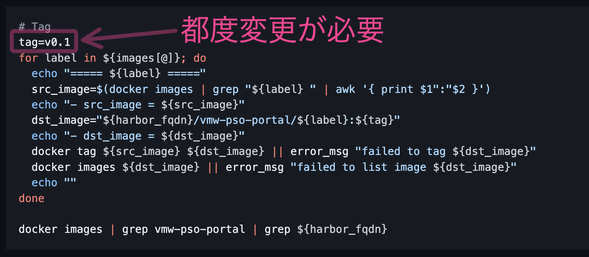

# PSO Portal Update

## コンテナイメージ格納

- [コンテナイメージ転送](https://github.com/nkdgc/server-setup/blob/main/kubernetes/fedora37/60-pso-portal-deploy.md#%E3%82%B3%E3%83%B3%E3%83%86%E3%83%8A%E3%82%A4%E3%83%A1%E3%83%BC%E3%82%B8%E8%BB%A2%E9%80%81-1) を実施し、コンテナイメージを管理クライアントに配置する。

- [コンテナイメージを Harbor に Push](https://github.com/nkdgc/server-setup/blob/main/kubernetes/fedora37/60-pso-portal-deploy.md#%E3%82%B3%E3%83%B3%E3%83%86%E3%83%8A%E3%82%A4%E3%83%A1%E3%83%BC%E3%82%B8%E3%82%92-harbor-%E3%81%AB-push-1) を実施し、コンテナイメージを Harbor に格納する。
  - ※注意※
    - Tag を付与する際の `tag=v0.1` は新しいアプリケーションを更新する度に異なる値を指定すること。 \
      ( `v0.1` , `v0.2` , `v0.3` のようにインクリメントするなど )
    - 

## manifests ファイル更新/適用

- 更新するコンテナイメージを用いた Deployment を定義しているファイルを更新する。各 Manifests ファイルで定義しているコンテナイメージは以下の通り。
  | コンテナイメージ | Manifest ファイル   |
  | :---             | :---                |
  | be-history       | be-history.yaml     |
  | be-inventory     | be-inventory.yaml   |
  | be-notice        | be-notice.yaml      |
  | be-nsx_lb        | be-nsx-lb.yaml      |
  | be-portal_auth   | be-portal-auth.yaml |
  | be-vcenter_vm    | be-vcenter-vm.yaml  |
  | bff              | bff.yaml            |
  | fe               | fe.yaml             |

- Backup
  ```bash
  cd ~/vmw-pso-portal-manifests/
  ll -R
    # -> manifests ファイルが存在すること
  
  # backup ディレクトリが存在しない場合は作成
  mkdir backup
  
  # backup
  cp -p <修正対象のManifestファイル> <修正対象のManifestファイル>_$(date +%Y_%m%d_%H%M)
  ls -l backup/<修正対象のManifestファイル>_$(date +%Y_%m%d_%H%M)
    # -> バックアップファイルが存在すること
  ```

- 修正
  ```bash
  vim <修正対象のManifestファイル>
  ```

  - `kind: Deployment` の `spec.template.spec.containers[0].image` に定義されているイメージのタグを Harbor に Push した際の Tag に変更する
    ```
    <例>
    変更前: - image: harbor2.home.ndeguchi.com/vmw-pso-portal/be-history:v0.1
    変更後: - image: harbor2.home.ndeguchi.com/vmw-pso-portal/be-history:v0.2
    ```

- 修正確認
  ```bash
  diff <修正対象のManifestファイル>_$(date +%Y_%m%d_%H%M) <修正対象のManifestファイル>
  ```
  - 確認観点：差分が Tag のみであること
    ```diff
    # diff -u backup/be-history.yaml_2024_0207_2334 be-history.yaml
    --- backup/be-history.yaml_2024_0207_2334       2024-02-07 18:47:28.845018658 +0900
    +++ be-history.yaml     2024-02-07 23:55:24.179057816 +0900
    @@ -41,7 +41,7 @@
             system: vmw-pso-portal
         spec:
           containers:
    -      - image: harbor2.home.ndeguchi.com/vmw-pso-portal/be-history:v0.1
    +      - image: harbor2.home.ndeguchi.com/vmw-pso-portal/be-history:v0.2
             name: be-history
             resources: {}
             envFrom:
    ```

- 適用
  ```bash
  kubectl apply -f <修正したManifestファイル>
  ```

- 確認
  ```bash
  kubectl get deployment -n vmw-pso-portal
  ```
  - 確認観点： 全ての Deployment の READY が `2/2` または `1/1` であること
    ```text
    NAME                READY   UP-TO-DATE   AVAILABLE   AGE
    be-history          2/2     2            2           32d
    be-inventory        2/2     2            2           32d
    be-notice           2/2     2            2           32d
    be-nsx-lb           2/2     2            2           32d
    be-portal-auth      2/2     2            2           32d
    be-vcenter-vm       2/2     2            2           32d
    bff                 2/2     2            2           32d
    console-openresty   2/2     2            2           32d
    fe                  2/2     2            2           32d
    postgres            1/1     1            1           32d
    ```

  ```bash
  for pod in $(kubectl get pod -n vmw-pso-portal | grep -v -e NAME -e history-detect-system -e console-openresty -e postgres -e vm-refresh | awk '{ print $1 }'); do
    image=$(kubectl get pod ${pod} -n vmw-pso-portal -o yaml | grep "image:" | head -n 1)
    echo "${pod} ${image}"
  done
  ```

  - 確認観点：指定したTagの値がPodのコンテナで指定されていること

    ```text
    be-history-7b95457ddb-wnwcp     image: harbor.energia.pso-portal/vmw-pso-portal/be-history:0.2
    be-history-7b95457ddb-xn4kl     image: harbor.energia.pso-portal/vmw-pso-portal/be-history:0.2
    be-inventory-bb46fd96b-2dw4r     image: harbor.energia.pso-portal/vmw-pso-portal/be-inventory:0.2
    be-inventory-bb46fd96b-4h9m2     image: harbor.energia.pso-portal/vmw-pso-portal/be-inventory:0.2
    be-notice-685b54cb84-2wd7c     image: harbor.energia.pso-portal/vmw-pso-portal/be-notice:0.2
    be-notice-685b54cb84-jhb9m     image: harbor.energia.pso-portal/vmw-pso-portal/be-notice:0.2
    be-nsx-lb-8bb96bb4d-lmfm7     image: harbor.energia.pso-portal/vmw-pso-portal/be-nsx_lb:0.2
    be-nsx-lb-8bb96bb4d-snk5j     image: harbor.energia.pso-portal/vmw-pso-portal/be-nsx_lb:0.2
    be-portal-auth-77c84b9bd5-ggppd     image: harbor.energia.pso-portal/vmw-pso-portal/be-portal_auth:0.2
    be-portal-auth-77c84b9bd5-m5llp     image: harbor.energia.pso-portal/vmw-pso-portal/be-portal_auth:0.2
    be-vcenter-vm-68b897b8d7-7kvgx     image: harbor.energia.pso-portal/vmw-pso-portal/be-vcenter_vm:0.2
    be-vcenter-vm-68b897b8d7-gcfrc     image: harbor.energia.pso-portal/vmw-pso-portal/be-vcenter_vm:0.2
    bff-5fb6bf9cd-p2pbr     image: harbor.energia.pso-portal/vmw-pso-portal/bff:0.2
    bff-5fb6bf9cd-t5f5m     image: harbor.energia.pso-portal/vmw-pso-portal/bff:0.2
    fe-8f7844bf6-8lpsc     image: harbor.energia.pso-portal/vmw-pso-portal/fe:0.2
    fe-8f7844bf6-bslq9     image: harbor.energia.pso-portal/vmw-pso-portal/fe:0.2
    ```

