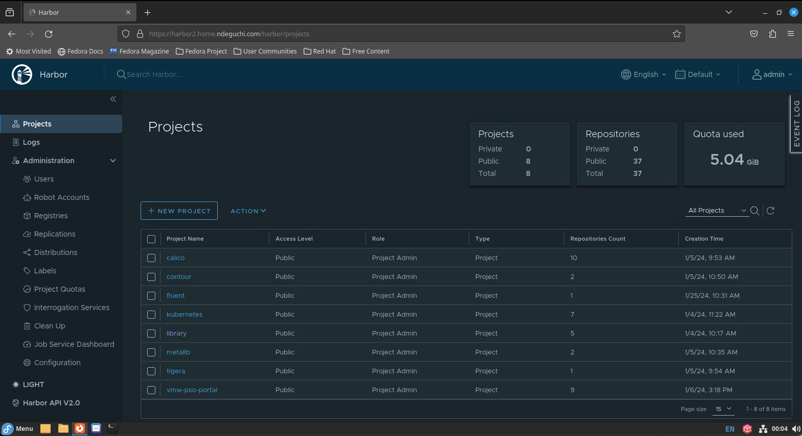
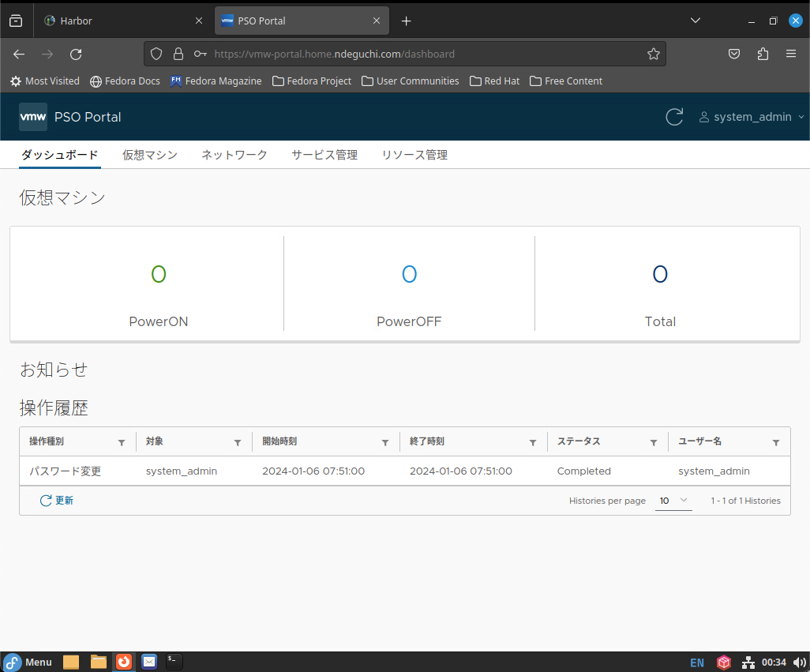

# Shutdown

## DB Backup, Shutdown

- DB バックアップ
  - 以下手順を実施 \
    [PSO Portal DB Backup/Restore](68-pso-portal-db-backup.md)

- DB 停止 \
  作業実施サーバ: 管理クライアント

  ```bash
  kubectl get pod -n vmw-pso-portal | grep postgres
    # ->"1/1 RUNNING" であること

  cd /root/vmw-pso-portal-manifests
  kubectl delete -f postgres.yaml
  ```

  - 確認観点：以下が出力されること
    ```text
    persistentvolume "nfs-postgres" deleted
    persistentvolumeclaim "postgres-data" deleted
    secret "postgres-secret" deleted
    deployment.apps "postgres" deleted
    service "postgres" deleted
    ```

  ```bash
  kubectl get pod -n vmw-pso-portal | grep postgres
    # -> 存在しないこと。存在する場合は数秒間待機して再実行。存在しなくなるまで繰り返し確認。
  ```

## Kubernetes ControlPlane/WorkerNode

- WorkerNode#1,2 shutdown
  - WorkerNode#1,2 に ssh でログインし `shutdown -h now` で shutdown する

- ControlPlane#1,2,3 shutdown
  - ControlPlane#1,2,3 に ssh でログインし `shutdown -h now` で shutdown する

## Harbor

作業実施サーバ: Harbor

```bash
docker ps
```
- 確認観点：Harbor のコンテナが起動していること
  ```text
  <出力例>
  CONTAINER ID   IMAGE                                COMMAND                   CREATED       STATUS                 PORTS                                                                            NAMES
  902acace1765   goharbor/harbor-jobservice:v2.9.1    "/harbor/entrypoint.…"   6 weeks ago   Up 6 weeks (healthy)                                                                                    harbor-jobservice
  a1bdf53282c5   goharbor/nginx-photon:v2.9.1         "nginx -g 'daemon of…"   6 weeks ago   Up 6 weeks (healthy)   0.0.0.0:80->8080/tcp, :::80->8080/tcp, 0.0.0.0:443->8443/tcp, :::443->8443/tcp   nginx
  51f7a34b9921   goharbor/harbor-core:v2.9.1          "/harbor/entrypoint.…"   6 weeks ago   Up 6 weeks (healthy)                                                                                    harbor-core
  de807f2e3b6a   goharbor/harbor-registryctl:v2.9.1   "/home/harbor/start.…"   6 weeks ago   Up 6 weeks (healthy)                                                                                    registryctl
  7d6a6e2a6144   goharbor/harbor-db:v2.9.1            "/docker-entrypoint.…"   6 weeks ago   Up 6 weeks (healthy)                                                                                    harbor-db
  3e1cc71a6116   goharbor/registry-photon:v2.9.1      "/home/harbor/entryp…"   6 weeks ago   Up 6 weeks (healthy)                                                                                    registry
  ecac0b6a4fd1   goharbor/harbor-portal:v2.9.1        "nginx -g 'daemon of…"   6 weeks ago   Up 6 weeks (healthy)                                                                                    harbor-portal
  01f7e582b770   goharbor/redis-photon:v2.9.1         "redis-server /etc/r…"   6 weeks ago   Up 6 weeks (healthy)                                                                                    redis
  e934614226f8   goharbor/harbor-log:v2.9.1           "/bin/sh -c /usr/loc…"   6 weeks ago   Up 6 weeks (healthy)   127.0.0.1:1514->10514/tcp                                                        harbor-log
  ```

```bash
cd ~/harbor
docker compose down
```

- 確認観点：以下が出力されること

  ```text
  <出力例>
  [+] Running 10/10
   ✔ Container registryctl        Removed    0.3s
   ✔ Container nginx              Removed    0.4s
   ✔ Container harbor-jobservice  Removed    0.3s
   ✔ Container harbor-portal      Removed    0.4s
   ✔ Container harbor-core        Removed    0.4s
   ✔ Container harbor-db          Removed    0.3s
   ✔ Container registry           Removed    0.3s
   ✔ Container redis              Removed    0.4s
   ✔ Container harbor-log         Removed   10.2s
   ✔ Network harbor_harbor        Removed    0.1s
  ```

```bash
shutdown -h now
```

## 管理クライアント

作業実施サーバ: 管理クライアント

```bash
shutdown -h now
```

# 起動

## 管理クライアント

- 管理クライアントを vSphere Client からパワーオン
- 正常性確認：sshでログインできること

## Harbor

- Harbor を vSphere Client からパワーオン
- 正常性確認(1): コンテナイメージ起動確認 \
  作業実施サーバ: Harbor
  ```bash
  docker ps
  ```
  - 確認観点：全てのコンテナの STATUS が UP かつ healthy であること
    ```text
    <出力例>
    CONTAINER ID   IMAGE                                COMMAND                   CREATED              STATUS                        PORTS                                                                            NAMES
    b2c207ea6d5c   goharbor/nginx-photon:v2.9.1         "nginx -g 'daemon of…"   About a minute ago   Up About a minute (healthy)   0.0.0.0:80->8080/tcp, :::80->8080/tcp, 0.0.0.0:443->8443/tcp, :::443->8443/tcp   nginx
    bd85a8d58696   goharbor/harbor-jobservice:v2.9.1    "/harbor/entrypoint.…"   About a minute ago   Up About a minute (healthy)                                                                                    harbor-jobservice
    a22f1e6aff9a   goharbor/harbor-core:v2.9.1          "/harbor/entrypoint.…"   About a minute ago   Up About a minute (healthy)                                                                                    harbor-core
    48af2f01560e   goharbor/harbor-portal:v2.9.1        "nginx -g 'daemon of…"   About a minute ago   Up About a minute (healthy)                                                                                    harbor-portal
    9efaaa246f59   goharbor/harbor-registryctl:v2.9.1   "/home/harbor/start.…"   About a minute ago   Up About a minute (healthy)                                                                                    registryctl
    f05e237068f1   goharbor/registry-photon:v2.9.1      "/home/harbor/entryp…"   About a minute ago   Up About a minute (healthy)                                                                                    registry
    e13567a8f730   goharbor/redis-photon:v2.9.1         "redis-server /etc/r…"   About a minute ago   Up About a minute (healthy)                                                                                    redis
    4220f8688d53   goharbor/harbor-db:v2.9.1            "/docker-entrypoint.…"   About a minute ago   Up About a minute (healthy)                                                                                    harbor-db
    5738ac13c84c   goharbor/harbor-log:v2.9.1           "/bin/sh -c /usr/loc…"   About a minute ago   Up About a minute (healthy)   127.0.0.1:1514->10514/tcp                                                        harbor-log
    ```

- 正常性確認(2)：管理クライアントに GUI でログインしWebブラウザで Harbor にログインできること
  - 

- 正常性確認(3)：管理クライアントの CLI で Harbor にログインできること \
  作業実施サーバ: 管理クライアント
  ```bash
  docker login ${harbor_fqdn}
  ```
  - 確認観点： `Login Succeeded` が出力されること
    ```text
    <出力例>
    Authenticating with existing credentials...
    WARNING! Your password will be stored unencrypted in /root/.docker/config.json.
    Configure a credential helper to remove this warning. See
    https://docs.docker.com/engine/reference/commandline/login/#credentials-store
    
    Login Succeeded
    ```

## Kubernetes ControlPlane#1,2,3

- ControlPlane#1,2,3 を vSphere Client からパワーオン
- 正常性確認：kubectl コマンドで Node の状態を確認できること \
  作業実施サーバ: 管理クライアント
  
  ```bash
  kubectl get node
  ```
  - 確認観点：Nodeの一覧が取得でき、ControlePlane の 3 台は `STATUS` が `READY` であること。 \
    ※WorkerNodeはまだ起動していないため `NotReady` で問題無い。
    ```text
    <出力例>
    NAME           STATUS     ROLES           AGE   VERSION
    k8s-cp01       Ready      control-plane   46d   v1.28.5
    k8s-cp02       Ready      control-plane   46d   v1.28.5
    k8s-cp03       Ready      control-plane   46d   v1.28.5
    k8s-worker01   NotReady   <none>          46d   v1.28.5
    k8s-worker02   NotReady   <none>          46d   v1.28.5
    ```

## Kubernetes WorkerNode#1,2

- WorkerNode#1,2 を vSphere Client からパワーオン

- 正常性確認：kubectl コマンドで Node の状態を確認できること \
  作業実施サーバ: 管理クライアント
  
  ```bash
  kubectl get node
  ```
  - 確認観点：Nodeの一覧が取得でき、全ての Node の `STATUS` が `READY` であること。
    ```text
    <出力例>
    NAME           STATUS   ROLES           AGE   VERSION
    k8s-cp01       Ready    control-plane   46d   v1.28.5
    k8s-cp02       Ready    control-plane   46d   v1.28.5
    k8s-cp03       Ready    control-plane   46d   v1.28.5
    k8s-worker01   Ready    <none>          46d   v1.28.5
    k8s-worker02   Ready    <none>          46d   v1.28.5
    ```

## DB 起動

作業実施サーバ: 管理クライアント

```bash
cd /root/vmw-pso-portal-manifests
kubectl apply -f postgres.yaml
```

- 確認観点：以下が出力されること
  ```text
  persistentvolume/nfs-postgres created
  persistentvolumeclaim/postgres-data created
  secret/postgres-secret created
  deployment.apps/postgres created
  service/postgres created
  ```

```bash
kubectl get pod -n vmw-pso-portal | grep postgres
  # ->"1/1 RUNNING" であること
```

## 正常性確認

- Pod 起動確認 \
  作業実施サーバ: 管理クライアント

  ```bash
  kubectl get pod -n vmw-pso-portal
  ```

  - 確認観点
    - `be-history-detect-system-errors-*` と `vm-refresh-*` の Pod 以外は `1/1 Running` であること
    - `be-history-detect-system-errors-*` と `vm-refresh-*` の Pod は直近に起動した処理が `0/1 Completed` であること
    - ```text
      <出力例>
      NAME                                             READY   STATUS      RESTARTS      AGE
      be-history-5b668f7ff-phpnl                       1/1     Running     4 (57s ago)   13d
      be-history-5b668f7ff-sr98n                       1/1     Running     3 (55s ago)   13d
      be-history-detect-system-errors-28474000-sb989   0/1     Completed   0             42m
      be-history-detect-system-errors-28474001-59wrg   0/1     Completed   0             41m
      be-history-detect-system-errors-28474041-84pfr   0/1     Error       0             95s
      be-history-detect-system-errors-28474042-kw8vh   0/1     Completed   0             35s
      be-inventory-647b9bdbf5-6sh6x                    1/1     Running     3 (82s ago)   13d
      be-inventory-647b9bdbf5-sqqq9                    1/1     Running     3 (53s ago)   13d
      be-notice-7f44f965ff-q995m                       1/1     Running     3 (64s ago)   13d
      be-notice-7f44f965ff-qrtr4                       1/1     Running     3 (79s ago)   13d
      be-nsx-lb-64486cc45-84bl8                        1/1     Running     1 (40m ago)   13d
      be-nsx-lb-64486cc45-vc9pf                        1/1     Running     1 (40m ago)   13d
      be-portal-auth-b864567c6-gwwg9                   1/1     Running     4 (48s ago)   13d
      be-portal-auth-b864567c6-mwv4n                   1/1     Running     3 (62s ago)   13d
      be-vcenter-vm-587d48748-nvbjb                    1/1     Running     3 (57s ago)   13d
      be-vcenter-vm-587d48748-rch2h                    1/1     Running     3 (77s ago)   13d
      bff-b5547dd7f-pjmqh                              1/1     Running     1 (40m ago)   13d
      bff-b5547dd7f-x567g                              1/1     Running     1 (40m ago)   13d
      console-openresty-786ff8cb55-9s7zm               1/1     Running     1 (40m ago)   45d
      console-openresty-786ff8cb55-sq5dp               1/1     Running     1 (40m ago)   45d
      fe-6bd576c4cf-2jk52                              1/1     Running     1 (40m ago)   13d
      fe-6bd576c4cf-lf4l5                              1/1     Running     1 (40m ago)   13d
      postgres-69d9b696b6-jq8hj                        1/1     Running     0             70s
      vm-refresh-28474000-n4h5x                        0/1     Completed   0             42m
      vm-refresh-28474001-2vlz8                        0/1     Completed   0             41m
      vm-refresh-28474041-wwjt9                        0/1     Error       0             95s
      vm-refresh-28474042-mrmzp                        0/1     Completed   0             35s
      ```

- GUI ログイン確認
  - Webブラウザで Portal にログインできることを確認する
    

